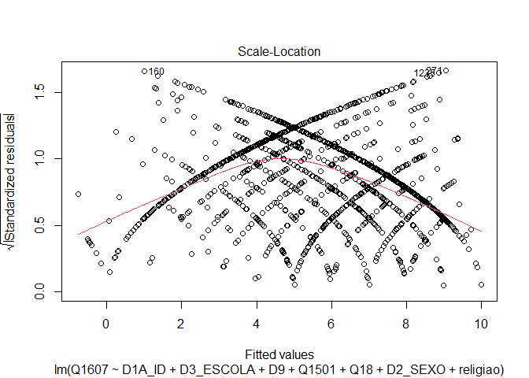
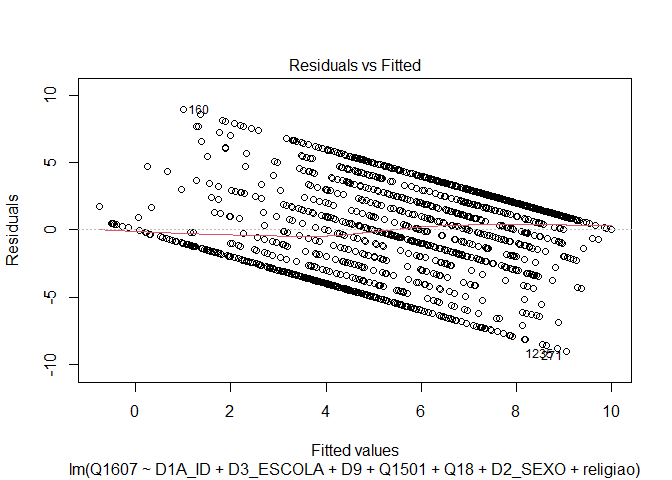
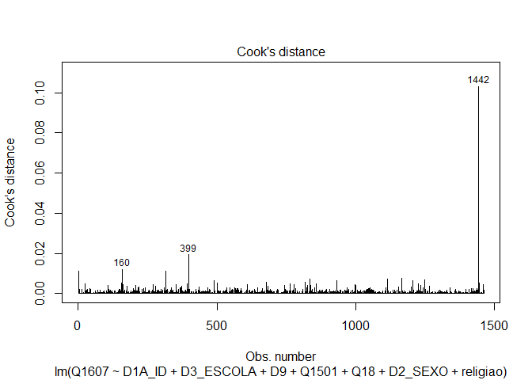
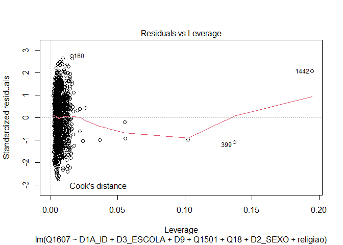

Exercicio 11
================

``` r
library(tidyverse)
library(haven)

link <- "https://github.com/MartinsRodrigo/Analise-de-dados/blob/master/04622.sav?raw=true"

download.file(link, "04622.sav", mode = "wb")

banco <- read_spss("04622.sav") 

banco <- banco %>%
  mutate(D10 = as_factor(D10)) %>%
  filter(Q1607 < 11, 
         Q18 < 11,
         D9 < 9999998,
         Q1501 < 11)


Outras <- levels(banco$D10)[-c(3,5,13)]

banco <- banco %>%
  mutate(religiao = case_when(D10 %in% Outras ~ "Outras",
                              D10 == "Católica" ~ "Católica",
                              D10 == "Evangélica" ~ "Evangélica",
                              D10 == "Não tem religião" ~ "Não tem religião"))
```

### Faça uma regressão linear avaliando em que medida as variáveis independentes utilizadas nos exercícios 7 e 8, idade(D1A\_ID), educação (D3\_ESCOLA), renda (D9), nota atribuída ao PT (Q1501), auto-atribuição ideológica (Q18), sexo (D2\_SEXO) e religião (variável criada no passo anterior) explicam a avaliação de Bolsonaro (Q1607)

``` r
regressao <- lm(Q1607 ~ D1A_ID + D3_ESCOLA +  D9 + Q1501 + Q18 + D2_SEXO + religiao, data = banco)

summary(regressao)
```

    ## 
    ## Call:
    ## lm(formula = Q1607 ~ D1A_ID + D3_ESCOLA + D9 + Q1501 + Q18 + 
    ##     D2_SEXO + religiao, data = banco)
    ## 
    ## Residuals:
    ##     Min      1Q  Median      3Q     Max 
    ## -9.0608 -2.5654  0.4179  2.3268  8.9954 
    ## 
    ## Coefficients:
    ##                            Estimate Std. Error t value Pr(>|t|)    
    ## (Intercept)               6.216e+00  5.365e-01  11.586  < 2e-16 ***
    ## D1A_ID                    1.040e-02  6.234e-03   1.669 0.095376 .  
    ## D3_ESCOLA                -1.116e-01  4.486e-02  -2.487 0.012982 *  
    ## D9                       -3.620e-05  2.764e-05  -1.309 0.190576    
    ## Q1501                    -3.946e-01  2.367e-02 -16.670  < 2e-16 ***
    ## Q18                       3.161e-01  2.603e-02  12.142  < 2e-16 ***
    ## D2_SEXO                  -6.874e-01  1.746e-01  -3.937 8.63e-05 ***
    ## religiaoEvangélica        6.685e-01  1.984e-01   3.370 0.000772 ***
    ## religiaoNão tem religião -7.565e-02  3.485e-01  -0.217 0.828177    
    ## religiaoOutras           -8.326e-01  3.081e-01  -2.702 0.006963 ** 
    ## ---
    ## Signif. codes:  0 '***' 0.001 '**' 0.01 '*' 0.05 '.' 0.1 ' ' 1
    ## 
    ## Residual standard error: 3.296 on 1452 degrees of freedom
    ## Multiple R-squared:  0.3018, Adjusted R-squared:  0.2975 
    ## F-statistic: 69.75 on 9 and 1452 DF,  p-value: < 2.2e-16

### Faça o teste de homoscedasticidade do modelo e corrija as estimações dos coeficientes caso seja necessário.

``` r
plot(regressao, 3)
```

<!-- -->

``` r
plot(regressao, 1)
```

<!-- -->

``` r
library(lmtest)

bptest(regressao)
```

    ## 
    ##  studentized Breusch-Pagan test
    ## 
    ## data:  regressao
    ## BP = 65.763, df = 9, p-value = 1.025e-10

``` r
library(car)

ncvTest(regressao) 
```

    ## Non-constant Variance Score Test 
    ## Variance formula: ~ fitted.values 
    ## Chisquare = 22.48512, Df = 1, p = 2.1178e-06

``` r
#corrigir

library(sandwich)

coeftest(regressao,
         vcov = vcovHC (regressao))
```

    ## 
    ## t test of coefficients:
    ## 
    ##                             Estimate  Std. Error  t value  Pr(>|t|)    
    ## (Intercept)               6.2160e+00  5.4715e-01  11.3607 < 2.2e-16 ***
    ## D1A_ID                    1.0403e-02  6.2657e-03   1.6603 0.0970600 .  
    ## D3_ESCOLA                -1.1159e-01  4.7247e-02  -2.3619 0.0183123 *  
    ## D9                       -3.6198e-05  3.6481e-05  -0.9922 0.3212463    
    ## Q1501                    -3.9464e-01  2.6381e-02 -14.9593 < 2.2e-16 ***
    ## Q18                       3.1608e-01  2.8534e-02  11.0772 < 2.2e-16 ***
    ## D2_SEXO                  -6.8736e-01  1.7967e-01  -3.8256 0.0001360 ***
    ## religiaoEvangélica        6.6854e-01  1.9676e-01   3.3978 0.0006978 ***
    ## religiaoNão tem religião -7.5647e-02  3.7488e-01  -0.2018 0.8401094    
    ## religiaoOutras           -8.3256e-01  3.0592e-01  -2.7215 0.0065759 ** 
    ## ---
    ## Signif. codes:  0 '***' 0.001 '**' 0.01 '*' 0.05 '.' 0.1 ' ' 1

Os testes formais de homocedasticidade apresentam p-valor alto o que
indica a presença de heterocedasticidade. A correção dos coeficientes é
feita pela função coeftest.

### Avalie a multicolinearidade entre as variáveis

``` r
vif(regressao)
```

    ##               GVIF Df GVIF^(1/(2*Df))
    ## D1A_ID    1.219401  1        1.104265
    ## D3_ESCOLA 1.337368  1        1.156446
    ## D9        1.094849  1        1.046350
    ## Q1501     1.119818  1        1.058215
    ## Q18       1.049195  1        1.024302
    ## D2_SEXO   1.023001  1        1.011435
    ## religiao  1.093846  3        1.015062

O teste de multicolinearidade mostra que não existe multicolinearidade
para as variáveis de idade, escolaridade, renda, avaliação do PT,
autoidentificação ideológica, sexo e religião por todos os resultados
estarem próximos ao valor de 1.

### Verifique a presença de outilier ou observações influentes no modelo

``` r
plot(regressao, 4)
```

<!-- -->

``` r
plot(regressao, 5)
```

<!-- -->

``` r
library(car)

outlierTest(regressao)
```

    ## No Studentized residuals with Bonferroni p < 0.05
    ## Largest |rstudent|:
    ##     rstudent unadjusted p-value Bonferroni p
    ## 271 -2.76344          0.0057918           NA

Os testes e gráficos apontam para não existência de outliers no banco
avaliado. Pois nenhuma das observações cruzam a linha vermelha de teste
(0.5), assim não é possível dizer que existem observações influentes no
modelo.

### Faça a regressao linear sem a observação mais influente e avalie a alteração do resultado

``` r
banco <- banco %>%
  slice(-c(1442))

regressao <- lm(Q1607 ~ D1A_ID + D3_ESCOLA +  D9 + Q1501 + Q18 + D2_SEXO + religiao, data = banco)

summary(regressao)
```

    ## 
    ## Call:
    ## lm(formula = Q1607 ~ D1A_ID + D3_ESCOLA + D9 + Q1501 + Q18 + 
    ##     D2_SEXO + religiao, data = banco)
    ## 
    ## Residuals:
    ##     Min      1Q  Median      3Q     Max 
    ## -9.1171 -2.4749  0.3718  2.3110  8.9899 
    ## 
    ## Coefficients:
    ##                            Estimate Std. Error t value Pr(>|t|)    
    ## (Intercept)               6.240e+00  5.360e-01  11.640  < 2e-16 ***
    ## D1A_ID                    1.133e-02  6.243e-03   1.814 0.069827 .  
    ## D3_ESCOLA                -1.022e-01  4.504e-02  -2.268 0.023446 *  
    ## D9                       -6.396e-05  3.071e-05  -2.083 0.037444 *  
    ## Q1501                    -3.975e-01  2.369e-02 -16.781  < 2e-16 ***
    ## Q18                       3.157e-01  2.600e-02  12.139  < 2e-16 ***
    ## D2_SEXO                  -7.080e-01  1.747e-01  -4.053 5.31e-05 ***
    ## religiaoEvangélica        6.807e-01  1.983e-01   3.433 0.000613 ***
    ## religiaoNão tem religião -6.671e-02  3.481e-01  -0.192 0.848065    
    ## religiaoOutras           -8.193e-01  3.078e-01  -2.662 0.007855 ** 
    ## ---
    ## Signif. codes:  0 '***' 0.001 '**' 0.01 '*' 0.05 '.' 0.1 ' ' 1
    ## 
    ## Residual standard error: 3.292 on 1451 degrees of freedom
    ## Multiple R-squared:  0.3037, Adjusted R-squared:  0.2994 
    ## F-statistic: 70.32 on 9 and 1451 DF,  p-value: < 2.2e-16

Em comparação ao modelo da regressão com os outliers, o modelo sem
outliers apresenta o mesmo valor de intercepto e significância
estatística para todas as variáveis independentes em zero. A variável
de idade não teve grande variação, com leve aumento para 1.133e-02,
apesar de sua significância estatística ter aumentado (0.069827) ainda
não se encontra dentro do parâmetro de 95% de confiança. A variável de
escolaridade teve um leve declínio para -1.022e-01 e uma baixa na sua
significância estatística (0.023446) que, no entanto, ainda se encontra
nos parâmetros de 95%. A variável de renda teve um aumento significante
para -6.396e-05 em comparação ao modelo com os outliers (-3.620e-05) e
sua significância estatística aumentou consideravelmente (0.037444)
passando a cumprir com o parâmetro de 95% aceitáveis à inferência.
Quanto à variável de avaliação do PT (-3.975e-01) e autoidentificação
ideológica (3.157e-01) houve um tímido aumento e a significância
estatística se manteve alta para ambas (\< 2e-16). A variável de gênero
dos respondentes sofreu um aumento relevante para –7.080e-01 e sua
relevância estatística se manteve alta (5.31e-05). Por fim, para
variável de religião que tem como categoria de referência os
respondentes católicos, a categoria dos evangélicos sofreu um leve
aumento para 6.807e-01 bem como em sua significância estatística
(0.000613) que permaneceu alta. Para aqueles que não tem religião houve
uma queda em sua variação para -6.671e-02 em relação ao valor
apresentado no modelo com outliers (-7.565e-02), porém o coeficiente
permaneceu sem relevância estatística (0.848065) quando comparados aos
católicos. Aqueles que se identificam com outras religiões sofreram uma
leve queda em sua variação (-8.193e-01), mas mantiveram sua
significância estatística (0.007855) dentro dos parâmetros aceitáveis
de 95% em comparação aos católicos. Além disso o R² teve um leve aumento
para 0.3037, o que aumenta a qualidade do modelo para explicar a
variável dependente.
