ExercÍcio 5
================
Laís Oliveira

### Carregue o banco de dados `world` que está no pacote `poliscidata`.

``` r
library(poliscidata)
library(tidyverse)
```

    ## -- Attaching packages ------------------------------------------- tidyverse 1.3.0 --

    ## v ggplot2 3.3.1     v purrr   0.3.4
    ## v tibble  3.0.1     v dplyr   1.0.0
    ## v tidyr   1.1.0     v stringr 1.4.0
    ## v readr   1.3.1     v forcats 0.5.0

    ## -- Conflicts ---------------------------------------------- tidyverse_conflicts() --
    ## x dplyr::filter() masks stats::filter()
    ## x dplyr::lag()    masks stats::lag()

``` r
library(ggthemes)
```

    ## Warning: package 'ggthemes' was built under R version 4.0.2

``` r
banco <- world %>%
  filter(!is.na(democ11),
         !is.na(fhrate04_rev),
         !is.na(fhrate08_rev),
         !is.na(polity),
         !is.na(gini08))
```

### Existem diversas medidas de democracia para os países: `dem_score14`, `democ11`, `fhrate04_rev`, `fhrate08_rev`, `polity`. Descreva-as graficamente e diga quais são as diferenças entre tais medidas.

``` r
ggplot (banco, aes(dem_score14)) +
geom_histogram() +
theme_minimal()
```

    ## `stat_bin()` using `bins = 30`. Pick better value with `binwidth`.

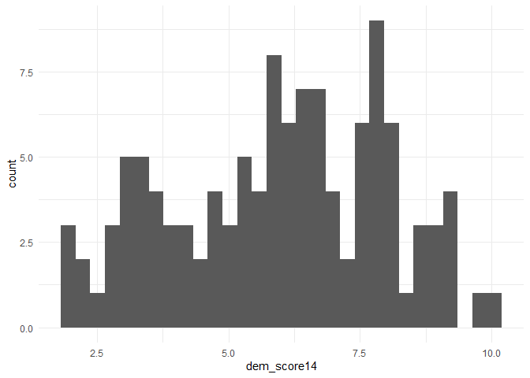<!-- -->

##### A variável contínua dem\_score14, mostra a nota da Democracia em 2014 pelo Economist. As maiores notas representam regimes mais democráticos.O gráfico desta variável apresenta distribuição variada as notas de maior ocorrência estão entre 2.5 e 9 (aproximandamente), sendo a nota 7.75 (aproximandamente) atribuída ao maior número de países em comparação ao restante.

``` r
ggplot (banco, aes(democ11)) +
geom_bar() +
theme_minimal()
```

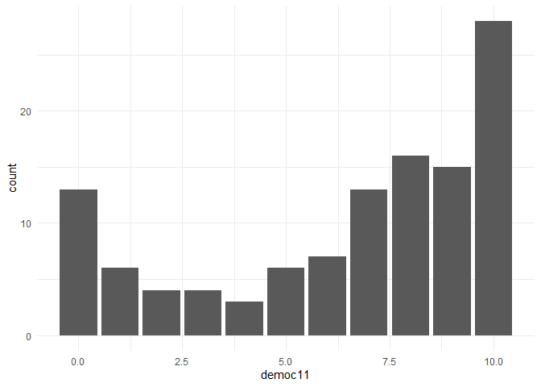<!-- -->

##### A variável numérica democ11, mostra a nota de democracia de países em 2011 pela Nações Unidas. Indo de 0 a 10 do menos democrático ao mais democrático. O gráfico desta variável se encontra mais distribuído entre os extremos, com 33 países atribuídos nota 10 (mais democráticos) e 23 países atribuídos nota 0 (menos democráticos).

``` r
ggplot (banco, aes(fhrate04_rev)) +
geom_bar() +
theme_minimal()
```

<!-- -->

##### A variável numérica fhrate04\_rev, mostra a escala de democracia pela Freedom House (reversa), sendo de 1 (menos livre) a 7 (mais livre).O gráfico de barras para a veriável representada posiciona o maior número de países (30) na maior nota para países democráticos (7), enquanto a segunda maior quantidade de países (19) é atribuída nota 2.5. As outras qualificações têm distribuição que varia pouco em número de países.

``` r
ggplot (banco, aes(fhrate08_rev)) +
geom_bar() +
theme_minimal()
```

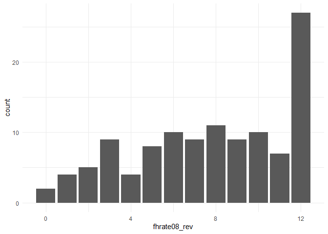<!-- -->

##### A variável numérica fhrate08\_rev, mostra a escala de democracia pela Freedom House, mas com escala de 0 (menos livre) a 12 (mais livre).Nesta escalonação 29 países foram atribuídos nota 12 sendo a maioria “mais livre”, enquanto o restante dos países se distribui sem muita variação entre o restante das notas.

``` r
ggplot (banco, aes(polity)) +
geom_bar() +
theme_minimal()
```

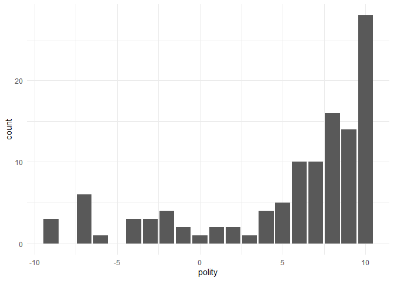<!-- -->

##### A variável numérica polity, mostra a notas de democracias, com maiores notas para regimes mais democráticos pela Polity.O gráfico apresenta o maior número de países (33) com nota 10 sendo mais democráticos. A maior quantidade de países se distribuem no setor positivo de valoração entre notas 5 e 10, indicando maior tendência a regimes mais democráticos. Existem algumas ocorrências de países com notas baixas para democracia como -7 (10) e -2 (8), podendo indicar regimes mais autoritários.

### Avalie a relação entre tais medidas de democracia e desigualdade, utilizando a variável `gini08`. Descreva graficamente esta variável, a relação entre as duas variáveis, meça a correlação entre elas e faça regressões lineares (interpretando em profundidade os resultados dos coeficientes e medidas de desempenho dos modelos). Enfatize as semelhanças e diferenças entre os resultados. Quais são suas conclusões?

``` r
ggplot(banco, aes(gini08)) +
geom_histogram() +
theme_minimal()
```

    ## `stat_bin()` using `bins = 30`. Pick better value with `binwidth`.

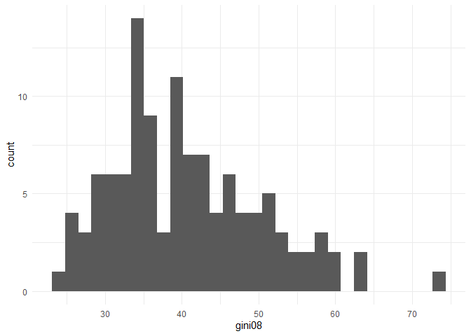<!-- -->

``` r
cor.test(banco$dem_score14, banco$gini08)
```

    ## 
    ##  Pearson's product-moment correlation
    ## 
    ## data:  banco$dem_score14 and banco$gini08
    ## t = -1.7824, df = 113, p-value = 0.07737
    ## alternative hypothesis: true correlation is not equal to 0
    ## 95 percent confidence interval:
    ##  -0.3382358  0.0182973
    ## sample estimates:
    ##        cor 
    ## -0.1653672

``` r
banco1 <- data.frame(banco$gini08, banco$dem_score14)

ggplot(banco, aes(gini08, dem_score14)) +
  geom_point() +
  geom_smooth(method = "lm")
```

    ## `geom_smooth()` using formula 'y ~ x'

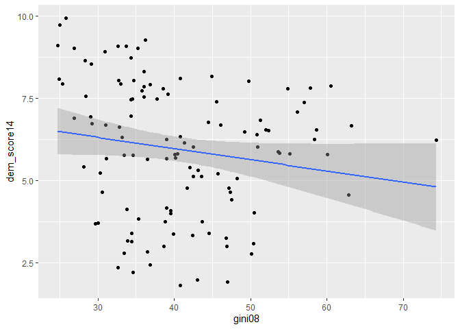<!-- -->

``` r
regressao1 <- lm(banco.gini08 ~ banco.dem_score14, data = banco1)

summary(regressao1)
```

    ## 
    ## Call:
    ## lm(formula = banco.gini08 ~ banco.dem_score14, data = banco1)
    ## 
    ## Residuals:
    ##     Min      1Q  Median      3Q     Max 
    ## -14.008  -7.204  -1.856   5.643  33.911 
    ## 
    ## Coefficients:
    ##                   Estimate Std. Error t value Pr(>|t|)    
    ## (Intercept)        45.4113     2.8379  16.002   <2e-16 ***
    ## banco.dem_score14  -0.8049     0.4516  -1.782   0.0774 .  
    ## ---
    ## Signif. codes:  0 '***' 0.001 '**' 0.01 '*' 0.05 '.' 0.1 ' ' 1
    ## 
    ## Residual standard error: 9.725 on 113 degrees of freedom
    ## Multiple R-squared:  0.02735,    Adjusted R-squared:  0.01874 
    ## F-statistic: 3.177 on 1 and 113 DF,  p-value: 0.07737

##### A correlação no valor de -0.165, sendo muito próximo de zero nos diz que não existe relação relevante entre as variáveis analisadas. O que é reafirmado pelo intervalo de confiança (-o.338 0.018) que contém o valor zero, não possuindo relevância estatística o que se verifica também pelo p-valor de 0.077 que se repete para a regressão. O coefieciente alfa representado pelo intercepto na regressão apresenta estimação de 45.411, erro padrão de 2.837 e valor t de 16.002, com p-valor de \<2e-16\*\*\*, representando grande relevância estatística. No entanto, o coeficiente beta que respresenta o valor da mudança em Y para cada mudança unitária de X tem valor estimado de -0.804, erro padrão de 0.451 e p-valor de 0.077.

``` r
cor.test(banco$democ11, banco$gini08)
```

    ## 
    ##  Pearson's product-moment correlation
    ## 
    ## data:  banco$democ11 and banco$gini08
    ## t = -0.90439, df = 113, p-value = 0.3677
    ## alternative hypothesis: true correlation is not equal to 0
    ## 95 percent confidence interval:
    ##  -0.26378781  0.09988899
    ## sample estimates:
    ##         cor 
    ## -0.08477203

``` r
banco2 <- data.frame(banco$gini08, banco$democ11)

ggplot(banco, aes(gini08, democ11)) +
  geom_point() +
  geom_smooth(method = "lm")
```

    ## `geom_smooth()` using formula 'y ~ x'

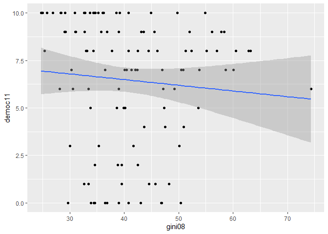<!-- -->

``` r
regressao2 <- lm(banco.gini08 ~ banco.democ11, data = banco2)

summary(regressao2)
```

    ## 
    ## Call:
    ## lm(formula = banco.gini08 ~ banco.democ11, data = banco2)
    ## 
    ## Residuals:
    ##     Min      1Q  Median      3Q     Max 
    ## -15.071  -7.211  -1.731   6.059  33.569 
    ## 
    ## Coefficients:
    ##               Estimate Std. Error t value Pr(>|t|)    
    ## (Intercept)    42.1711     1.9462  21.669   <2e-16 ***
    ## banco.democ11  -0.2400     0.2654  -0.904    0.368    
    ## ---
    ## Signif. codes:  0 '***' 0.001 '**' 0.01 '*' 0.05 '.' 0.1 ' ' 1
    ## 
    ## Residual standard error: 9.826 on 113 degrees of freedom
    ## Multiple R-squared:  0.007186,   Adjusted R-squared:  -0.0016 
    ## F-statistic: 0.8179 on 1 and 113 DF,  p-value: 0.3677

##### A correlação no valor de -0.084, sendo muito próximo de zero nos diz que não existe relação relevante entre as variáveis analisadas. O que se reafirma pelo intervalo de confiança (-o.263 0.099) que contém o valor zero, não possuindo relevância estatística o que se verifica também pelo p-valor de 0.084. O coefieciente alfa representado pelo intercepto na regressão apresenta estimação de 42.171, erro padrão de 1.946 e valor t de 21.669, com p-valor de \<2e-16\*\*\*, representando grande relevância estatística. No entanto, o coeficiente beta que respresenta o quanto Y muda para cada mudança unitária de X tem valor estimado de -0.240, erro padrão de 0.265 e p-valor de 0.367, que está muito alto para representar qualquer relevância estatística. Podendo o resultado ser encontrado de forma aleatória com probabilidade de 36%.

``` r
cor.test(banco$fhrate04_rev, banco$gini08)
```

    ## 
    ##  Pearson's product-moment correlation
    ## 
    ## data:  banco$fhrate04_rev and banco$gini08
    ## t = -1.2625, df = 113, p-value = 0.2094
    ## alternative hypothesis: true correlation is not equal to 0
    ## 95 percent confidence interval:
    ##  -0.29468718  0.06660813
    ## sample estimates:
    ##        cor 
    ## -0.1179408

``` r
banco3 <- data.frame(banco$gini08, banco$fhrate04_rev)

ggplot(banco, aes(gini08, fhrate04_rev)) +
  geom_point() +
  geom_smooth(method = "lm")
```

    ## `geom_smooth()` using formula 'y ~ x'

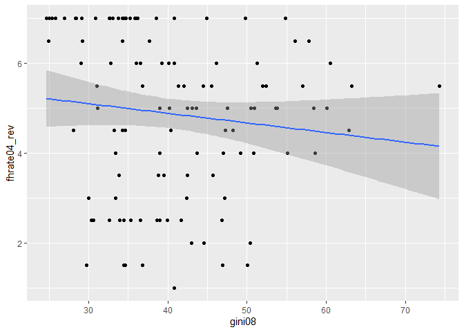<!-- -->

``` r
regressao3 <- lm(banco.gini08 ~ banco.fhrate04_rev, data = banco3)

summary(regressao3)
```

    ## 
    ## Call:
    ## lm(formula = banco.gini08 ~ banco.fhrate04_rev, data = banco3)
    ## 
    ## Residuals:
    ##     Min      1Q  Median      3Q     Max 
    ## -14.664  -7.374  -2.009   5.738  34.088 
    ## 
    ## Coefficients:
    ##                    Estimate Std. Error t value Pr(>|t|)    
    ## (Intercept)         43.7791     2.6649  16.428   <2e-16 ***
    ## banco.fhrate04_rev  -0.6485     0.5137  -1.263    0.209    
    ## ---
    ## Signif. codes:  0 '***' 0.001 '**' 0.01 '*' 0.05 '.' 0.1 ' ' 1
    ## 
    ## Residual standard error: 9.792 on 113 degrees of freedom
    ## Multiple R-squared:  0.01391,    Adjusted R-squared:  0.005184 
    ## F-statistic: 1.594 on 1 and 113 DF,  p-value: 0.2094

##### A correlação no valor de -0.117, sendo muito próximo de zero nos diz que não existe relação relevante entre as variáveis analisadas. Sendo reafirmado pelo intervalo de confiança (-0.294 0.066) que contém o valor zero, não possuindo relevância estatística, o que se verifica também pelo p-valor de 0.209 que se repete para a regressão. O coefieciente alfa representado pelo intercepto na regressão apresenta estimação de 43.779, erro padrão de 2.664 e valor t de 16.428, com p-valor de \<2e-16\*\*\*, representando grande relevância estatística. No entanto, o coeficiente beta que respresenta o valor da mudança em Y para cada mudança unitária de X tem valor estimado de -0.648, erro padrão de 0.513 e p-valor de 0.209, sendo muito alto para representar qualquer relevância estatística dos resultados encontrados.

``` r
cor.test(banco$fhrate08_rev, banco$gini08)
```

    ## 
    ##  Pearson's product-moment correlation
    ## 
    ## data:  banco$fhrate08_rev and banco$gini08
    ## t = -1.2591, df = 113, p-value = 0.2106
    ## alternative hypothesis: true correlation is not equal to 0
    ## 95 percent confidence interval:
    ##  -0.29439757  0.06692384
    ## sample estimates:
    ##        cor 
    ## -0.1176281

``` r
banco4 <- data.frame(banco$gini08, banco$fhrate08_rev)

ggplot(banco, aes(gini08, fhrate08_rev)) +
  geom_point() +
  geom_smooth(method = "lm")
```

    ## `geom_smooth()` using formula 'y ~ x'

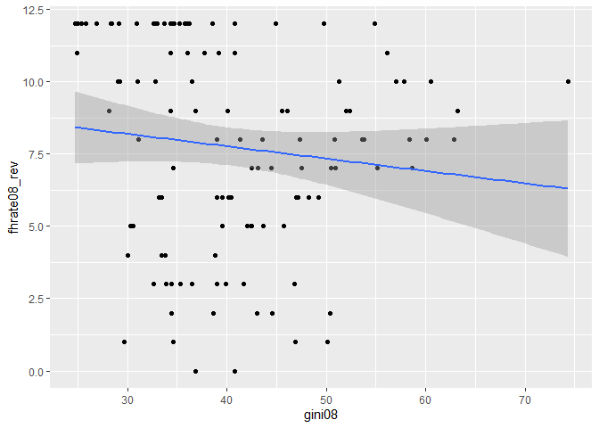<!-- -->

``` r
regressao4 <- lm(banco.gini08 ~ banco.fhrate08_rev, data = banco4)

summary(regressao4)
```

    ## 
    ## Call:
    ## lm(formula = banco.gini08 ~ banco.fhrate08_rev, data = banco4)
    ## 
    ## Residuals:
    ##     Min      1Q  Median      3Q     Max 
    ## -14.662  -7.419  -2.005   5.854  34.414 
    ## 
    ## Coefficients:
    ##                    Estimate Std. Error t value Pr(>|t|)    
    ## (Intercept)         43.1241     2.1896  19.695   <2e-16 ***
    ## banco.fhrate08_rev  -0.3238     0.2572  -1.259    0.211    
    ## ---
    ## Signif. codes:  0 '***' 0.001 '**' 0.01 '*' 0.05 '.' 0.1 ' ' 1
    ## 
    ## Residual standard error: 9.793 on 113 degrees of freedom
    ## Multiple R-squared:  0.01384,    Adjusted R-squared:  0.005109 
    ## F-statistic: 1.585 on 1 and 113 DF,  p-value: 0.2106

##### A correlação das variáveis no valor de -0.117, sendo muito próximo de zero nos diz que não existe relação relevante. Reafirmado pelo intervalo de confiança (-o.294 0.066) que contém o valor zero, não possuindo relevância estatística, o que se verifica também pelo p-valor de 0.210 que se repete para a regressão. O coefieciente alfa representado pelo intercepto na regressão apresenta estimação de 43.124, erro padrão de 2.189 e valor t de 19.695, com p-valor de \<2e-16\*\*\*, representando grande relevância estatística. No entanto, o coeficiente beta que respresenta o valor da mudança em Y para cada mudança unitária de X tem valor estimado de -0.323, erro padrão de 0.257 e p-valor de 0.211, muito acima do desejado para representar qualquer relevância estatística dos resultados.

``` r
cor.test(banco$polity, banco$gini08)
```

    ## 
    ##  Pearson's product-moment correlation
    ## 
    ## data:  banco$polity and banco$gini08
    ## t = -0.43417, df = 113, p-value = 0.665
    ## alternative hypothesis: true correlation is not equal to 0
    ## 95 percent confidence interval:
    ##  -0.2222590  0.1433725
    ## sample estimates:
    ##         cor 
    ## -0.04080936

``` r
banco5 <- data.frame(banco$gini08, banco$polity)

ggplot(banco, aes(gini08, polity)) +
  geom_point() +
  geom_smooth(method = "lm")
```

    ## `geom_smooth()` using formula 'y ~ x'

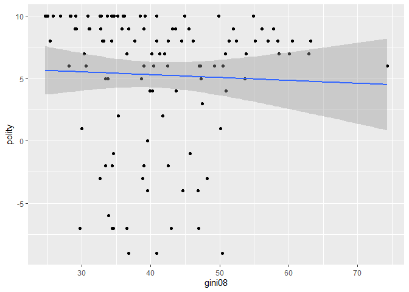<!-- -->

``` r
regressao5 <- lm(banco.gini08 ~ banco.polity, data = banco5)

summary(regressao5)
```

    ## 
    ## Call:
    ## lm(formula = banco.gini08 ~ banco.polity, data = banco5)
    ## 
    ## Residuals:
    ##     Min      1Q  Median      3Q     Max 
    ## -15.576  -7.166  -1.566   6.056  33.734 
    ## 
    ## Coefficients:
    ##              Estimate Std. Error t value Pr(>|t|)    
    ## (Intercept)  41.00234    1.27543  32.148   <2e-16 ***
    ## banco.polity -0.07265    0.16732  -0.434    0.665    
    ## ---
    ## Signif. codes:  0 '***' 0.001 '**' 0.01 '*' 0.05 '.' 0.1 ' ' 1
    ## 
    ## Residual standard error: 9.853 on 113 degrees of freedom
    ## Multiple R-squared:  0.001665,   Adjusted R-squared:  -0.007169 
    ## F-statistic: 0.1885 on 1 and 113 DF,  p-value: 0.665

##### O valor da correlação dessas variáveis de -0.040, sendo muito próximo de zero nos diz que não existe relação relevante entre as variáveis analisadas. O que é reafirmado pelo intervalo de confiança (-o.222 0.143) que contém o valor zero, não possuindo relevância estatística, o que se verifica também pelo p-valor de 0.665 que se repete para a regressão. O coefieciente alfa representado pelo intercepto na regressão apresenta estimação de 41.002, erro padrão de 1.275 e valor t de 32.148, com p-valor de \<2e-16\*\*\*, representando grande relevância estatística. Entretanto, o coeficiente beta que respresenta o valor da mudança em Y para cada mudança unitária de X tem valor estimado de -0.072, erro padrão de 0.167, t-valor de -0.434 e p-valor de 0.665, extremamente alto para inferir qualquer relevância estatística dos resultados encontrados.

##### **Os resultados das análises das variáveis sobre democracia e desigualdade não parecem mostrar relação com relevância estatística. As variáveis numéricas que escalonam o nível de democracia apresentam resultados com p-valor muito alto para se inferir qualquer relevância estatística dos resultados. Enquanto a variável contínua (democ\_score14), apesar de apresentar p-valor razoável para a regressão dos resultados quando se faz a correlação poor encontrarmos o valor de zero no intervalo de confiança e o valor da correlação estar próximo de zero podemos concluir que a relação entre as variáveis é bastante fraca se aproximando da hipótese nula.**

### Avalie a relação entre tais medidas de democracia e crescimento econômico, utilizando a variável `gdppcap08`. Descreva graficamente esta variável, a relação entre as duas variáveis, meça a correlação entre elas e faça regressões lineares (interpretando em profundidade os resultados dos coeficientes e medidas de desempenho dos modelos). Enfatize as semelhanças e diferenças entre os resultados. Quais são suas conclusões?

``` r
ggplot(banco, aes(gdppcap08)) +
geom_density()
```

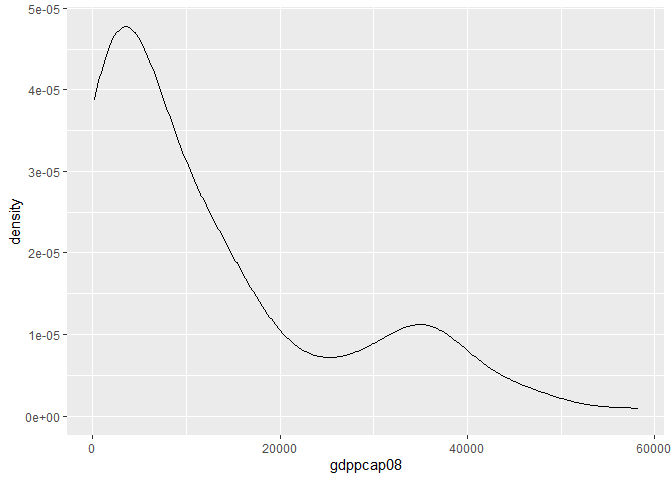<!-- -->

``` r
cor.test(banco$dem_score14, banco$gdppcap08)
```

    ## 
    ##  Pearson's product-moment correlation
    ## 
    ## data:  banco$dem_score14 and banco$gdppcap08
    ## t = 10.621, df = 113, p-value < 2.2e-16
    ## alternative hypothesis: true correlation is not equal to 0
    ## 95 percent confidence interval:
    ##  0.6015664 0.7879482
    ## sample estimates:
    ##       cor 
    ## 0.7068186

``` r
banco6 <- data.frame(banco$gdppcap08, banco$dem_score14)

ggplot(banco, aes(gdppcap08, dem_score14)) +
  geom_point() +
  geom_smooth(method = "lm")
```

    ## `geom_smooth()` using formula 'y ~ x'

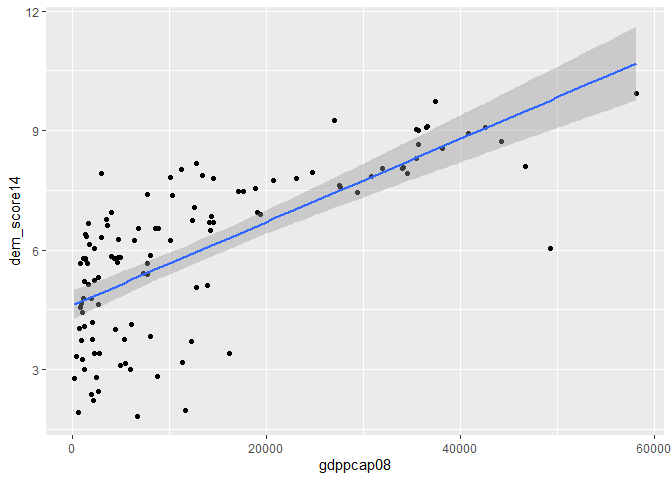<!-- -->

``` r
regressao6 <- lm(banco.gdppcap08 ~ banco.dem_score14, data = banco6)

summary(regressao6)
```

    ## 
    ## Call:
    ## lm(formula = banco.gdppcap08 ~ banco.dem_score14, data = banco6)
    ## 
    ## Residuals:
    ##    Min     1Q Median     3Q    Max 
    ## -19257  -7290  -1611   6834  36096 
    ## 
    ## Coefficients:
    ##                   Estimate Std. Error t value Pr(>|t|)    
    ## (Intercept)       -15657.0     2830.3  -5.532 2.07e-07 ***
    ## banco.dem_score14   4783.7      450.4  10.621  < 2e-16 ***
    ## ---
    ## Signif. codes:  0 '***' 0.001 '**' 0.01 '*' 0.05 '.' 0.1 ' ' 1
    ## 
    ## Residual standard error: 9699 on 113 degrees of freedom
    ## Multiple R-squared:  0.4996, Adjusted R-squared:  0.4952 
    ## F-statistic: 112.8 on 1 and 113 DF,  p-value: < 2.2e-16

##### A correlação da variáveis com valor de 0.706 apresenta valor mais perto de 1 que de zero o que significa que há moderada relevência estatística na relação entre as variáveis analisadas.Reafirmada pelo baixíssimo p-valor de 2.2e-16 - que se reperte na regressão - e pelo fato de o intervalo de confiança (0.601 0.787) não conter o valor de zero. O intercepto (alfa) tem valor estimado de -15657, erro padrão de 2830.3, t-valor de -5.532 e p-valor de 2.07e-07. O beta tem valor estimado de 4783.7, erro padrão de 450.4, t-valor de 10.621 e p-valor de 2e-16. Sendo o p-valor representado com \*\*\*, inferímos alta relevância estatística para os resultados.

``` r
cor.test(banco$democ11, banco$gdppcap08)
```

    ## 
    ##  Pearson's product-moment correlation
    ## 
    ## data:  banco$democ11 and banco$gdppcap08
    ## t = 6.1836, df = 113, p-value = 1.025e-08
    ## alternative hypothesis: true correlation is not equal to 0
    ## 95 percent confidence interval:
    ##  0.3521309 0.6281004
    ## sample estimates:
    ##       cor 
    ## 0.5028201

``` r
banco7 <- data.frame(banco$gdppcap08, banco$democ11)

ggplot(banco, aes(gdppcap08, democ11)) +
  geom_point() +
  geom_smooth(method = "lm")
```

    ## `geom_smooth()` using formula 'y ~ x'

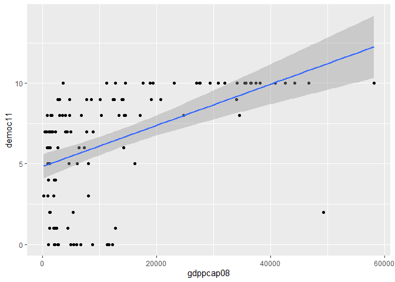<!-- -->

``` r
regressao7 <- lm(banco.gdppcap08 ~ banco.democ11, data = banco7)

summary(regressao7)
```

    ## 
    ## Call:
    ## lm(formula = banco.gdppcap08 ~ banco.democ11, data = banco7)
    ## 
    ## Residuals:
    ##    Min     1Q Median     3Q    Max 
    ## -16252  -9160  -2467   6915  45303 
    ## 
    ## Coefficients:
    ##               Estimate Std. Error t value Pr(>|t|)    
    ## (Intercept)      21.95    2347.57   0.009    0.993    
    ## banco.democ11  1979.58     320.13   6.184 1.03e-08 ***
    ## ---
    ## Signif. codes:  0 '***' 0.001 '**' 0.01 '*' 0.05 '.' 0.1 ' ' 1
    ## 
    ## Residual standard error: 11850 on 113 degrees of freedom
    ## Multiple R-squared:  0.2528, Adjusted R-squared:  0.2462 
    ## F-statistic: 38.24 on 1 and 113 DF,  p-value: 1.025e-08

##### A correlação da variáveis apresenta valor de 0.502, que apesar não estar perto de zero também não esta perto de 1, do que se conclui baixa significância estatística para a relação das variáveis. No entanto, o intervalo (0.352 0.628) não contém o valor de zero e o p-valor de 1.025e-08 -que se repete para a regressão-, pode representar relevância estatísca.Os coeficientes do intercepto (alfa) apresentam valor estimado de 21.95, erro padrão de 2347.57, t-valor de 0.009 e altíssimo p-valor de 0.993. Enquanto o coeficiente beta apresenta valor estimado de 1979, erro padrão 320.13, t-valor de 6.184 e p-valor de 1.03e-08. Apesar do p-valor de 1.025e-08 ser baixo, não podemos concluir com total certeza sobre a relevância estatística da relação entre variáveis por termos alto p-valor para alfa e pelo valor da correlação não indicar forte nem moderada relação entre as variáveis.

``` r
cor.test(banco$fhrate04_rev, banco$gdppcap08)
```

    ## 
    ##  Pearson's product-moment correlation
    ## 
    ## data:  banco$fhrate04_rev and banco$gdppcap08
    ## t = 8.4081, df = 113, p-value = 1.423e-13
    ## alternative hypothesis: true correlation is not equal to 0
    ## 95 percent confidence interval:
    ##  0.4932910 0.7215154
    ## sample estimates:
    ##       cor 
    ## 0.6203658

``` r
banco8 <- data.frame(banco$gdppcap08, banco$fhrate04_rev)

ggplot(banco, aes(gdppcap08, fhrate04_rev)) +
  geom_point() +
  geom_smooth(method = "lm")
```

    ## `geom_smooth()` using formula 'y ~ x'

<!-- -->

``` r
regressao8 <- lm(banco.gdppcap08 ~ banco.fhrate04_rev, data = banco8)

summary(regressao8)
```

    ## 
    ## Call:
    ## lm(formula = banco.gdppcap08 ~ banco.fhrate04_rev, data = banco8)
    ## 
    ## Residuals:
    ##    Min     1Q Median     3Q    Max 
    ## -17042  -8113  -1924   6211  42972 
    ## 
    ## Coefficients:
    ##                    Estimate Std. Error t value Pr(>|t|)    
    ## (Intercept)        -10288.6     2926.6  -3.516 0.000633 ***
    ## banco.fhrate04_rev   4743.1      564.1   8.408 1.42e-13 ***
    ## ---
    ## Signif. codes:  0 '***' 0.001 '**' 0.01 '*' 0.05 '.' 0.1 ' ' 1
    ## 
    ## Residual standard error: 10750 on 113 degrees of freedom
    ## Multiple R-squared:  0.3849, Adjusted R-squared:  0.3794 
    ## F-statistic:  70.7 on 1 and 113 DF,  p-value: 1.423e-13

##### A correlação no valor de 0.620, indica relação baixa para moderada entre as variáveis. O intervalo de confiança (0.493 0.721) não contém o valor de zero e p-valor de 1.423e-13 é baixo se repetindo para a regressão, o que pode representar releviância estatística significativa. O coeficiente alfa (incerpto) tem valor estimado de -10288.6, erro padrão de 2926.6, t-valor de -3.516 e p-valor de 0.0006. Beta, representando o valor da mudança em Y para uma mudança unitária em X, tem valor estimado de 4743.1, erro padrão de 564.1, t-valor de 8.408 e p-valor de 1.42e-13. O ínfimo p-valor (\*\*\*) para as operações representa grande confiança estatística nos resultados de que há uma relação moderada entre as variáveis, como se retira do valor de 0.6 da correlação.

``` r
cor.test(banco$fhrate08_rev, banco$gdppcap08)
```

    ## 
    ##  Pearson's product-moment correlation
    ## 
    ## data:  banco$fhrate08_rev and banco$gdppcap08
    ## t = 8.4371, df = 113, p-value = 1.222e-13
    ## alternative hypothesis: true correlation is not equal to 0
    ## 95 percent confidence interval:
    ##  0.4949088 0.7225399
    ## sample estimates:
    ##       cor 
    ## 0.6216807

``` r
banco9 <- data.frame(banco$gdppcap08, banco$fhrate08_rev)

ggplot(banco, aes(gdppcap08, fhrate08_rev)) +
  geom_point() +
  geom_smooth(method = "lm")
```

    ## `geom_smooth()` using formula 'y ~ x'

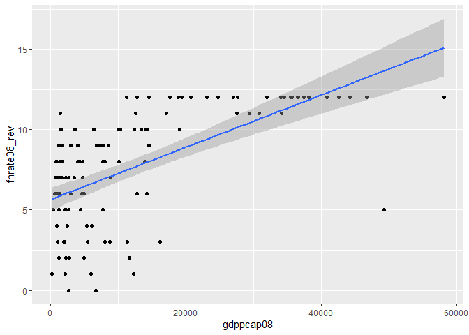<!-- -->

``` r
regressao9 <- lm(banco.gdppcap08 ~ banco.fhrate08_rev, data = banco9)

summary(regressao9)
```

    ## 
    ## Call:
    ## lm(formula = banco.gdppcap08 ~ banco.fhrate08_rev, data = banco9)
    ## 
    ## Residuals:
    ##    Min     1Q Median     3Q    Max 
    ## -19136  -8092  -3064   6720  42973 
    ## 
    ## Coefficients:
    ##                    Estimate Std. Error t value Pr(>|t|)    
    ## (Intercept)           -5586       2401  -2.326   0.0218 *  
    ## banco.fhrate08_rev     2380        282   8.437 1.22e-13 ***
    ## ---
    ## Signif. codes:  0 '***' 0.001 '**' 0.01 '*' 0.05 '.' 0.1 ' ' 1
    ## 
    ## Residual standard error: 10740 on 113 degrees of freedom
    ## Multiple R-squared:  0.3865, Adjusted R-squared:  0.3811 
    ## F-statistic: 71.19 on 1 and 113 DF,  p-value: 1.222e-13

##### Como na variável analisada acima o valor da correlação de 0.621, representa relação moderada entre as variáveis. O intervalo (0.494 0.722) por não conter o valor de zero reafirma a relação e o p-valor de 1.222e-13 importa alta confiança aos resultados. O intercepto (alfa) tem valor estimado de -5586, erro padrão de 2401, t-valor de -2.326 e p-valor de 0.021. Enquanto, beta tem valor estimado de 2380 em relação a Y para cada mudança unitária de X, com erro padrão de 282, t-valor de 8.437 e p-valor de 1.22e-13. Apesar de alfa ter p-valor com \* representando somente certa relevância estatística, o resultado das operações estatísticas têm p-valor de 1.22e-13 com \*\*\* apresenta altíssima relevância estatística para os resultados.

``` r
cor.test(banco$polity, banco$gdppcap08)
```

    ## 
    ##  Pearson's product-moment correlation
    ## 
    ## data:  banco$polity and banco$gdppcap08
    ## t = 4.8455, df = 113, p-value = 4.052e-06
    ## alternative hypothesis: true correlation is not equal to 0
    ## 95 percent confidence interval:
    ##  0.2507019 0.5556790
    ## sample estimates:
    ##       cor 
    ## 0.4147718

``` r
banco10 <- data.frame(banco$gdppcap08, banco$polity)

ggplot(banco, aes(gdppcap08, polity)) +
  geom_point() +
  geom_smooth(method = "lm")
```

    ## `geom_smooth()` using formula 'y ~ x'

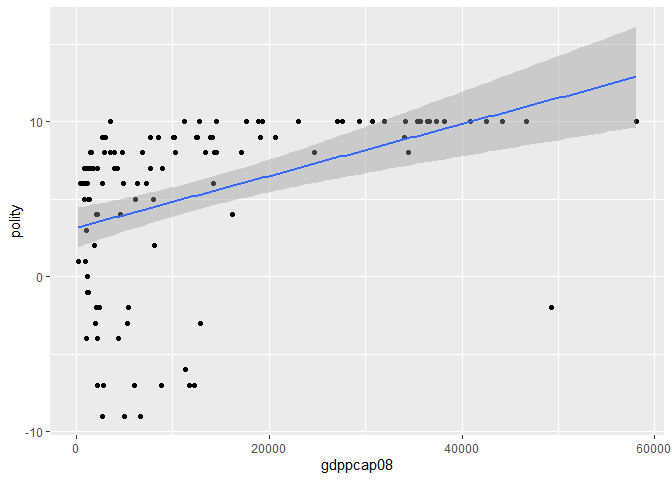<!-- -->

``` r
regressao10 <- lm(banco.gdppcap08 ~ banco.polity, data = banco10)

summary(regressao10)
```

    ## 
    ## Call:
    ## lm(formula = banco.gdppcap08 ~ banco.polity, data = banco10)
    ## 
    ## Residuals:
    ##    Min     1Q Median     3Q    Max 
    ## -14162  -9429  -3203   8481  43936 
    ## 
    ## Coefficients:
    ##              Estimate Std. Error t value Pr(>|t|)    
    ## (Intercept)    7401.1     1615.0   4.583 1.19e-05 ***
    ## banco.polity   1026.7      211.9   4.846 4.05e-06 ***
    ## ---
    ## Signif. codes:  0 '***' 0.001 '**' 0.01 '*' 0.05 '.' 0.1 ' ' 1
    ## 
    ## Residual standard error: 12480 on 113 degrees of freedom
    ## Multiple R-squared:  0.172,  Adjusted R-squared:  0.1647 
    ## F-statistic: 23.48 on 1 and 113 DF,  p-value: 4.052e-06

##### O valor de 0.414 para a correlação entre as variáveis não está ideal para inferir baixa relação entre as variáveis, estando muito próximo à zero tendendo a não apresentar relação. No entanto, o intervalo (0.250 0.555) não contém o valor de zero o que suporta a hipótese de relação entre as variáveis com alta confiança que se retira do p-valor de 4.052e-06, mesmo para a regressão. O coeficiente de alfa tem valor estimado de 7401.1, erro padrão de 1615, t-valor de 4.583 e p-valor de 1.19e-05 \*\*\*. Beta tem valor estimado de 1026.7, erro padrão de 211.9, t-valor de 4.846 e p-valor 4.05e-06 representando alta confiança de que os mesmo resultado se encontra de forma aleatória em ínfima probabilidade.

##### **Mais uma vez a variável contínua que mede democracia apresenta resultados mais contundentes de afirmação com relação forte entre as variáveis, enquanto as numéricas parecem trazer resultados menos conclusivos. No entanto, todos os resultados apresentam grande relevância estatísticas com p-valores que representam grande confiança nos resultados.**

### Avalie a relação entre tais medidas de democracia e produção de petróleo, utilizando a variável `oil`. Descreva graficamente esta variável, a relação entre as duas variáveis, meça a correlação entre elas e faça regressões lineares (interpretando em profundidade os resultados dos coeficientes e medidas de desempenho dos modelos). Enfatize as semelhanças e diferenças entre os resultados. Quais são suas conclusões?

``` r
ggplot(banco, aes(oil)) +
geom_histogram()
```

    ## `stat_bin()` using `bins = 30`. Pick better value with `binwidth`.

<!-- -->

``` r
cor.test(banco$dem_score14, banco$oil)
```

    ## 
    ##  Pearson's product-moment correlation
    ## 
    ## data:  banco$dem_score14 and banco$oil
    ## t = -0.65492, df = 113, p-value = 0.5138
    ## alternative hypothesis: true correlation is not equal to 0
    ## 95 percent confidence interval:
    ##  -0.2418802  0.1230022
    ## sample estimates:
    ##         cor 
    ## -0.06149326

``` r
banco11 <- data.frame(banco$oil, banco$dem_score14)

ggplot(banco, aes(oil, dem_score14)) +
  geom_point() +
  geom_smooth(method = "lm")
```

    ## `geom_smooth()` using formula 'y ~ x'

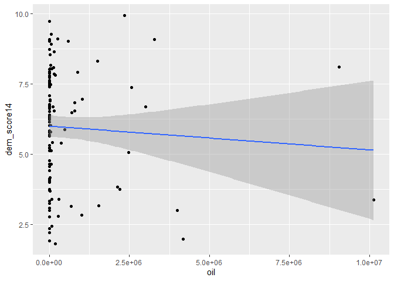<!-- -->

``` r
regressao11 <- lm(banco.oil ~ banco.dem_score14, data = banco11)

summary(regressao11)
```

    ## 
    ## Call:
    ## lm(formula = banco.oil ~ banco.dem_score14, data = banco11)
    ## 
    ## Residuals:
    ##     Min      1Q  Median      3Q     Max 
    ## -690453 -522680 -445849 -310520 9494954 
    ## 
    ## Coefficients:
    ##                   Estimate Std. Error t value Pr(>|t|)  
    ## (Intercept)         776916     429878   1.807   0.0734 .
    ## banco.dem_score14   -44799      68404  -0.655   0.5138  
    ## ---
    ## Signif. codes:  0 '***' 0.001 '**' 0.01 '*' 0.05 '.' 0.1 ' ' 1
    ## 
    ## Residual standard error: 1473000 on 113 degrees of freedom
    ## Multiple R-squared:  0.003781,   Adjusted R-squared:  -0.005035 
    ## F-statistic: 0.4289 on 1 and 113 DF,  p-value: 0.5138

##### Com correlação no valor de -0.061 concluimos pela irrelevância da relação entre variáveis já que o valor está tão perto de zero. Isso se reafirma pelo intervalo (-o.241 0.123) conter o valor de zero e pelo alto p-valor de 0.513. O valor estimado para alfa (intercepto) é de 776916, com erro padrão de 429878 e t-valor de 1.807, já o valor estimado para mudança na variável depende é de -44799 para uma mudança unitária da variável independente, com erro padrão de 68404, t-valor de -0.655. Apesar do p-valor de 0.073 para alfa o p-valor da regressão é de 0.513 que não importa significância estatística relevante para os resultados.

``` r
cor.test(banco$democ11, banco$oil)
```

    ## 
    ##  Pearson's product-moment correlation
    ## 
    ## data:  banco$democ11 and banco$oil
    ## t = -0.79846, df = 113, p-value = 0.4263
    ## alternative hypothesis: true correlation is not equal to 0
    ## 95 percent confidence interval:
    ##  -0.2545211  0.1097138
    ## sample estimates:
    ##         cor 
    ## -0.07490142

``` r
banco12 <- data.frame(banco$oil, banco$democ11)

ggplot(banco, aes(oil, democ11)) +
  geom_point() +
  geom_smooth(method = "lm")
```

    ## `geom_smooth()` using formula 'y ~ x'

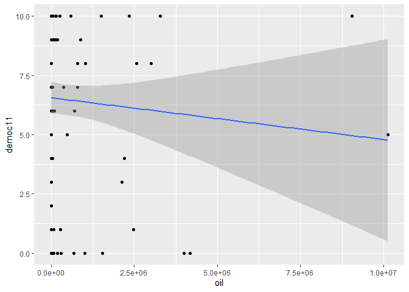<!-- -->

``` r
regressao12 <- lm(banco.oil ~ banco.democ11, data = banco12)

summary(regressao12)
```

    ## 
    ## Call:
    ## lm(formula = banco.oil ~ banco.democ11, data = banco12)
    ## 
    ## Residuals:
    ##     Min      1Q  Median      3Q     Max 
    ## -715503 -493305 -426592 -292719 9563210 
    ## 
    ## Coefficients:
    ##               Estimate Std. Error t value Pr(>|t|)  
    ## (Intercept)     715503     291527   2.454   0.0156 *
    ## banco.democ11   -31743      39755  -0.798   0.4263  
    ## ---
    ## Signif. codes:  0 '***' 0.001 '**' 0.01 '*' 0.05 '.' 0.1 ' ' 1
    ## 
    ## Residual standard error: 1472000 on 113 degrees of freedom
    ## Multiple R-squared:  0.00561,    Adjusted R-squared:  -0.00319 
    ## F-statistic: 0.6375 on 1 and 113 DF,  p-value: 0.4263

##### Como na variável acima o valor da correlação (-0.074) tão próximo de zero indica que não há relação relevante entre as variáveis. Reafirmado mais uma vez pelo valor de zero estar contido do intervalo (-0.254 0.109) e p-valor de 0.426. Alfa tem valor estimado de 715503, erro padrão de 291527, t-valor 2.454 e p-valor de 0.0156 \*. Beta têm valor estimado em ralação à Y de -31743 para cada mudança unitária na variável independente, erro padrão de 39755 e t-valor de -0.798. O p.valor de 0.426 indica irrelevância estatítisca para os resultados encontrados.

``` r
cor.test(banco$fhrate04_rev, banco$oil)
```

    ## 
    ##  Pearson's product-moment correlation
    ## 
    ## data:  banco$fhrate04_rev and banco$oil
    ## t = -0.87768, df = 113, p-value = 0.382
    ## alternative hypothesis: true correlation is not equal to 0
    ## 95 percent confidence interval:
    ##  -0.2614566  0.1023673
    ## sample estimates:
    ##         cor 
    ## -0.08228558

``` r
banco13 <- data.frame(banco$oil, banco$fhrate04_rev)

ggplot(banco, aes(oil, fhrate04_rev)) +
  geom_point() +
  geom_smooth(method = "lm")
```

    ## `geom_smooth()` using formula 'y ~ x'

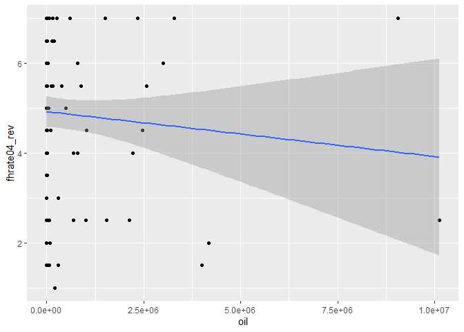<!-- -->

``` r
regressao13 <- lm(banco.oil ~ banco.fhrate04_rev, data = banco13)

summary(regressao13)
```

    ## 
    ## Call:
    ## lm(formula = banco.oil ~ banco.fhrate04_rev, data = banco13)
    ## 
    ## Residuals:
    ##     Min      1Q  Median      3Q     Max 
    ## -738632 -535464 -427906 -300173 9449090 
    ## 
    ## Coefficients:
    ##                    Estimate Std. Error t value Pr(>|t|)  
    ## (Intercept)          840216     400308   2.099   0.0381 *
    ## banco.fhrate04_rev   -67723      77161  -0.878   0.3820  
    ## ---
    ## Signif. codes:  0 '***' 0.001 '**' 0.01 '*' 0.05 '.' 0.1 ' ' 1
    ## 
    ## Residual standard error: 1471000 on 113 degrees of freedom
    ## Multiple R-squared:  0.006771,   Adjusted R-squared:  -0.002019 
    ## F-statistic: 0.7703 on 1 and 113 DF,  p-value: 0.382

##### A correlação no valor de -0.082 mostra a irrelevância da relação entre as variáveis, reafirmada pelo valor de zero estar contido no intervalo (-0.261 0.102) e pelo alto p-valor de 0.382. Alfa (intercepto) tem valor estimado de 840216, erro padrão de 400308, t-valor de 2.099 e p-valor de 0.038 \*. Já beta tem valor estimado para mudança em Y de -67723 para uma mudança unitária em X, com erro padrão de 77161, t-valor de -0.878 e p-valor de 0.382, indicando a irrelevância estatística para os resultados.

``` r
cor.test(banco$fhrate08_rev, banco$oil)
```

    ## 
    ##  Pearson's product-moment correlation
    ## 
    ## data:  banco$fhrate08_rev and banco$oil
    ## t = -0.9324, df = 113, p-value = 0.3531
    ## alternative hypothesis: true correlation is not equal to 0
    ## 95 percent confidence interval:
    ##  -0.26622835  0.09728962
    ## sample estimates:
    ##         cor 
    ## -0.08737746

``` r
banco14 <- data.frame(banco$oil, banco$fhrate08_rev)

ggplot(banco, aes(oil, fhrate08_rev)) +
  geom_point() +
  geom_smooth(method = "lm")
```

    ## `geom_smooth()` using formula 'y ~ x'

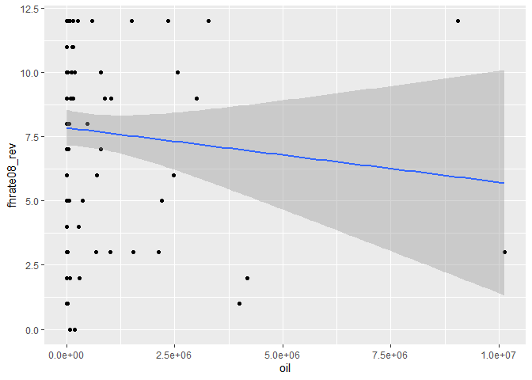<!-- -->

``` r
regressao14 <- lm(banco.oil ~ banco.fhrate08_rev, data = banco14)

summary(regressao14)
```

    ## 
    ## Call:
    ## lm(formula = banco.oil ~ banco.fhrate08_rev, data = banco14)
    ## 
    ## Residuals:
    ##     Min      1Q  Median      3Q     Max 
    ## -752752 -543181 -404790 -290765 9439248 
    ## 
    ## Coefficients:
    ##                    Estimate Std. Error t value Pr(>|t|)  
    ## (Intercept)          788752     328764   2.399   0.0181 *
    ## banco.fhrate08_rev   -36000      38610  -0.932   0.3531  
    ## ---
    ## Signif. codes:  0 '***' 0.001 '**' 0.01 '*' 0.05 '.' 0.1 ' ' 1
    ## 
    ## Residual standard error: 1470000 on 113 degrees of freedom
    ## Multiple R-squared:  0.007635,   Adjusted R-squared:  -0.001147 
    ## F-statistic: 0.8694 on 1 and 113 DF,  p-value: 0.3531

##### Mais uma vez a tendencia da variável analisada é pela não relação, já que o valor da correlação se encontra próximo a zero (-0.087), e o zero está contido no intervalo (-0.266 0.097) o que se reflete no alto p-valor de 0.353, sendo o mesmo para os resultados da regressão, com coeficiente alfa (intercepto) com valor estimado de 788752, erro padrão de 328764, t-valor de 2.399 e p-valor de 0.018 \*, enquanto beta tem valor estimado de -36000 de mudança na variável dependente para uma mudança unitária na variável independente, com erro padrão de 38610, t-valor de -0.932 e p-valor de 0.353 que representa a insignificância estatística dos resultados encontrados.

``` r
cor.test(banco$polity, banco$oil)
```

    ## 
    ##  Pearson's product-moment correlation
    ## 
    ## data:  banco$polity and banco$oil
    ## t = -0.89111, df = 113, p-value = 0.3748
    ## alternative hypothesis: true correlation is not equal to 0
    ## 95 percent confidence interval:
    ##  -0.2626286  0.1011219
    ## sample estimates:
    ##         cor 
    ## -0.08353532

``` r
banco15 <- data.frame(banco$oil, banco$polity)

ggplot(banco, aes(oil, polity)) +
  geom_point() +
  geom_smooth(method = "lm")
```

    ## `geom_smooth()` using formula 'y ~ x'

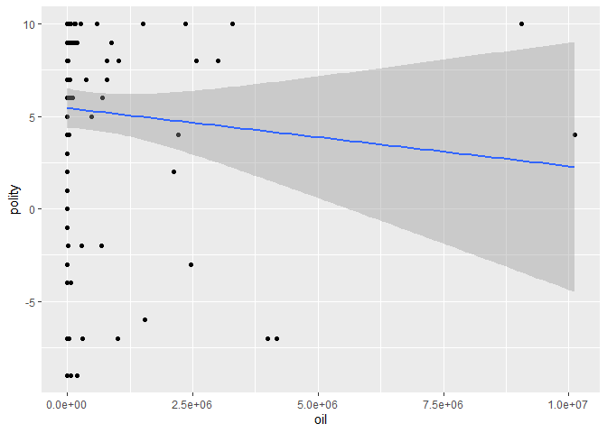<!-- -->

``` r
regressao15 <- lm(banco.oil ~ banco.polity, data = banco15)

summary(regressao15)
```

    ## 
    ## Call:
    ## lm(formula = banco.oil ~ banco.polity, data = banco15)
    ## 
    ## Residuals:
    ##     Min      1Q  Median      3Q     Max 
    ## -828133 -494272 -427499 -291520 9581214 
    ## 
    ## Coefficients:
    ##              Estimate Std. Error t value Pr(>|t|)   
    ## (Intercept)    627816     190392   3.297   0.0013 **
    ## banco.polity   -22257      24977  -0.891   0.3748   
    ## ---
    ## Signif. codes:  0 '***' 0.001 '**' 0.01 '*' 0.05 '.' 0.1 ' ' 1
    ## 
    ## Residual standard error: 1471000 on 113 degrees of freedom
    ## Multiple R-squared:  0.006978,   Adjusted R-squared:  -0.00181 
    ## F-statistic: 0.7941 on 1 and 113 DF,  p-value: 0.3748

##### Seguindo a lógica das variáveis acima, esta relação também pode ser entendida como insignificante, visto que o valor da correlação é de -0.083 e o zero está contido no intervalo (-0.262 0.101) o que se reflete no p-valor alto de 0.374. Para a regressão, o coeficiente alfa tem valor estimado de 627816, com erro padrão de 190392, t-valor de 3.297 e p-valor de 0.0013 \*\* e coeficiente beta com valor estimado de mudança em Y de -22257 para cada mudança unitária em X, com erro padrão de 24977, t-valor de -0.891 e p-valor de 0.374 reafirmando a insignificância estatística dos resultados.

##### **Pelos valores das correlações entre as variáveis de democracia e petróleo a hipótese nula da não relação parece ser afirmada para todas as variáveis analisadas. Os altos p-valores reafirmam essas conclusões já que apresentam altas probabilidades do resultado ser encontrado de forma aleatória.**

### Avalie a relação entre crescimento econômico e produção de petróleo. Descreva a relação entre as duas variáveis, meça a correlação entre elas e faça regressões lineares (interpretando em profundidade os resultados dos coeficientes e medidas de desempenho dos modelos). Enfatize as semelhanças e diferenças entre os resultados. Quais são suas conclusões?

``` r
cor.test(banco$gdppcap08, banco$oil)
```

    ## 
    ##  Pearson's product-moment correlation
    ## 
    ## data:  banco$gdppcap08 and banco$oil
    ## t = 2.2802, df = 113, p-value = 0.02447
    ## alternative hypothesis: true correlation is not equal to 0
    ## 95 percent confidence interval:
    ##  0.02768811 0.37831656
    ## sample estimates:
    ##       cor 
    ## 0.2097352

``` r
banco16 <- data.frame(banco$gdppcap08, banco$oil)

ggplot(banco, aes(gdppcap08, oil)) +
  geom_point() +
  geom_smooth(method = "lm")
```

    ## `geom_smooth()` using formula 'y ~ x'

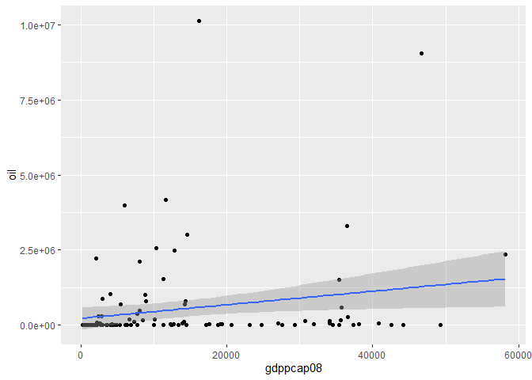<!-- -->

``` r
regressao16 <- lm(banco.oil ~ banco.gdppcap08, data = banco16)

summary(regressao16)
```

    ## 
    ## Call:
    ## lm(formula = banco.oil ~ banco.gdppcap08, data = banco16)
    ## 
    ## Residuals:
    ##      Min       1Q   Median       3Q      Max 
    ## -1322271  -499938  -268683  -226950  9535128 
    ## 
    ## Coefficients:
    ##                  Estimate Std. Error t value Pr(>|t|)  
    ## (Intercept)     2.205e+05  1.851e+05   1.192   0.2359  
    ## banco.gdppcap08 2.258e+01  9.901e+00   2.280   0.0245 *
    ## ---
    ## Signif. codes:  0 '***' 0.001 '**' 0.01 '*' 0.05 '.' 0.1 ' ' 1
    ## 
    ## Residual standard error: 1443000 on 113 degrees of freedom
    ## Multiple R-squared:  0.04399,    Adjusted R-squared:  0.03553 
    ## F-statistic: 5.199 on 1 and 113 DF,  p-value: 0.02447

##### A correlação no valor de 0.209 indica tendencia as variáveis não estarem relacionadas já que se encontre perto de zero. No entanto, há a possibilidade desta relação ser fraca, já que não é refutável uma vez que o zero não está contido no intervalo (0.0276 0.378) e tem p-valor razoável de 0.024. Na regressão alfa (intercepto) tem valor estimado de 1.184e+04, com erro padrão de 1.324e+03, t-valor de 8.939 e p-valor de 8.66e-15 \*\*\*, enquanto beta tem valor estimado de mudança para a variável dependente de 1.948e-03, com erro padrão de 8.545e-04, t-valor de 2.280 e p-valor de 0.0245 que indica relevância estatística aceitável para os resultados.

##### **A partir das operações efetuadas é possível inferir por uma relação ao mínimo fraca entre renda per capta e produção de petróleo, visto que há por volta de 98% de confiança que para mudanças unitárias na variável independente temos mudanças na variável dependentes, reafirmada pelo intervalo da correlação não conter o valor de zero.**

### A partir das suas conclusões sobre a relação entre democracia, economia e produção de petróleo, quais considerações são possíveis fazer sobre a relação CAUSAL entre estas variáveis? Lembre dos 4 “hurdles” do livro *Fundamentals of Political Science Research*

##### **Para a relação entre democracia e economia é possível existir mecanismo causal no sentido de que o regime político, abrangendo as mais diversas áreas da sociedade afete de alguma forma a economia (hurdle 1). No entanto, regimes políticos não tendem a ser determinados pelo desempenho da economia (hurdle 2). As variáveis contínuas que medem democracia apresentaram melhores resultados para a afirmação da relação causal da democracia com a desigualdade e a renda per capta (hurdle 3). Uma possível variável Z seria a produção de petróleo que, pela análise dos dados, apesar de ter relação com a economia, não parece demonstrar nenhuma relação com o regime democrático, o que pode enfraquecer a relação causal de democracia com economia (hurdle 4).**
