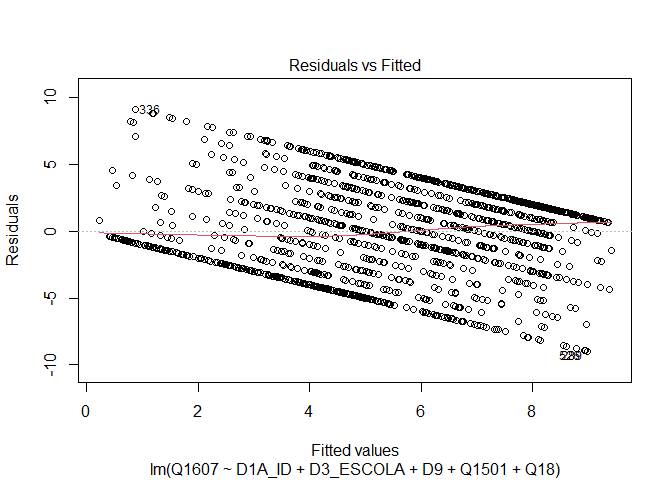
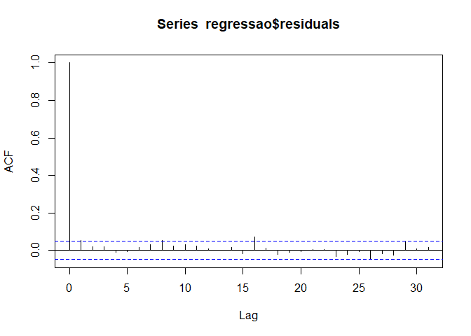
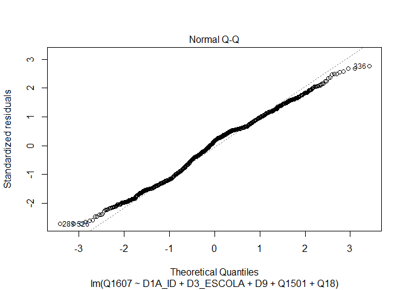

Exercicio 7
================
Alune

### No exercício anterior foram feitos alguns modelos bivariados. Agora faça uma regressão multivariada mostrando como a nota atribuída a Jair Bolsonaro (variável Q1607) pode ser explicada pelas variáveis idade (D1A\_ID), educação (D3\_ESCOLA), renda (D9), nota atribuída ao PT (Q1501) e auto-atribuição ideológica (Q18) dos respondentes. Interprete o resultado a partir das informações dadas pelo sumário da regressão.

``` r
library(tidyverse)
library(haven)
library(ggthemes)
library(scales)

url <- "https://github.com/MartinsRodrigo/Analise-de-dados/raw/master/04622.sav"

download.file(url, "banco.sav", mode = "wb")

banco <- read_sav("banco.sav")

banco_filtrado <- banco %>%
  filter(Q1607 <= 10,
         D9 != 9999998 & 9999999,
         Q1501 <= 10,
         Q18 <= 10)

regressao <- lm(Q1607 ~ D1A_ID + D3_ESCOLA + D9 + Q1501 + Q18, data = banco_filtrado)

summary(regressao)
```

    ## 
    ## Call:
    ## lm(formula = Q1607 ~ D1A_ID + D3_ESCOLA + D9 + Q1501 + Q18, data = banco_filtrado)
    ## 
    ## Residuals:
    ##     Min      1Q  Median      3Q     Max 
    ## -8.9913 -2.5290  0.5154  2.1682  9.1317 
    ## 
    ## Coefficients:
    ##               Estimate Std. Error t value Pr(>|t|)    
    ## (Intercept)  5.687e+00  4.531e-01  12.550  < 2e-16 ***
    ## D1A_ID       5.648e-03  5.929e-03   0.953    0.341    
    ## D3_ESCOLA   -1.717e-01  4.122e-02  -4.165 3.28e-05 ***
    ## D9          -6.987e-09  3.174e-08  -0.220    0.826    
    ## Q1501       -4.093e-01  2.244e-02 -18.241  < 2e-16 ***
    ## Q18          3.309e-01  2.512e-02  13.176  < 2e-16 ***
    ## ---
    ## Signif. codes:  0 '***' 0.001 '**' 0.01 '*' 0.05 '.' 0.1 ' ' 1
    ## 
    ## Residual standard error: 3.317 on 1576 degrees of freedom
    ## Multiple R-squared:  0.289,  Adjusted R-squared:  0.2867 
    ## F-statistic: 128.1 on 5 and 1576 DF,  p-value: < 2.2e-16

### Em que medida os resultados se mantém ou se alteram quando comparados com os resultados do exercício anterior, quando foram utilizadas apenas regressões bivariadas?

A regressão multivariada, diferente das regressões feitas no último
exercício explica mais sobre a relação entre a variavél dependente e as
variáveis independentes. O que se verifica pelo R² que aponta que o
modelo explica 28.9% da variável dependente. Enquanto o erro padrão
residual, em geral, diminuiu para 3.31. Ao analisar os coeficientes
temos valores estimados próximos à zero para mudanças em Y em um
acréscimo unitáro em X controlando por todas as variáveis
independentes. No entanto, os p-valores se diferenciam para diferentes
variáveis independentes. As variáveis que medem ideade e renda dos
respondentes apresentam insignificância estatística por apresentarem
altos p-valores. As outras variáveis apresentam significância
estatística para a relação com a variável dependente.

### A partir da exposição de gráficos e testes, avalie se o modelo se adequa aos pressupostos que uma regressão linear exige.

``` r
plot(regressao, 1)
```

<!-- --> Pela
análise do gráfico percebemos que a linha vermelha esta bem próxima a
linha pontilhada que cruza o eixo y no zero, ou seja, o gráfico não
apresenta nenhum padrão, o que indica que o pressuposto da linearidade
foi atendido.

``` r
library(lmtest)

bptest(regressao)
```

    ## 
    ##  studentized Breusch-Pagan test
    ## 
    ## data:  regressao
    ## BP = 54.963, df = 5, p-value = 1.328e-10

A homocedasticidade, no entanto, não foi atendida, visto que há um alto
BP de 54.963 pois os pontos estão distribuidos ao longo do eixo x para
cima e para baixo ao longo do eixo x de forma não ideal.

``` r
acf(regressao$residuals)
```

<!-- --> As
linhas verticais estão dentro do pontilhado azul, com exceção da
primeira linha sendo o resultado ideal, cumprindo com o pressuposto da
ausência de autocorrelção de entre casos/resíduos.

``` r
library(MASS)
plot(regressao, 2)
```

<!-- -->

``` r
sresid <- studres(regressao) 
shapiro.test(sresid)
```

    ## 
    ##  Shapiro-Wilk normality test
    ## 
    ## data:  sresid
    ## W = 0.98781, p-value = 2.885e-10

Sendo a hipótese nula a normalidade dos resíduos e o p-valor de
2.885e-10 se encontrar próximo a zero poderíamos rejeitar a hipótese
nula, o que não é ideal.

### Caso algum pressuposto não seja satisfeito, quais são as consequências específicas para o modelo estimado?

No caso da homocedasticidade não ser atendida, a confiabilidade dos
testes de significância e intervalos de confiança é afetada. É
necessário assumir a distribuição normal dos resíduos, assim esperamos
um alto p-valor para o teste para que não possamos rejeitar a hipótese
nula, o que não acontece para o modelo apresentado.

### Considerando o 4o hurdle do livro *Fundamentals…*, faça um modelo de regressão extra adicionando uma variável **numérica** que foi omitida do modelo anterior, mas que possa ter relação causal com a variável dependente (e talvez alguma associação com as independentes anteriores). Justifique a variável extra e analise o resultado.

``` r
banco_filtrado1 <- banco %>%
  filter (P20 < 2)

regressao <- lm(Q1607 ~ D1A_ID + D3_ESCOLA + D9 + Q1501 + Q18 + P20, data = banco_filtrado)

summary(regressao)
```

    ## 
    ## Call:
    ## lm(formula = Q1607 ~ D1A_ID + D3_ESCOLA + D9 + Q1501 + Q18 + 
    ##     P20, data = banco_filtrado)
    ## 
    ## Residuals:
    ##     Min      1Q  Median      3Q     Max 
    ## -8.8950 -2.4763  0.4723  2.1460  8.9570 
    ## 
    ## Coefficients:
    ##               Estimate Std. Error t value Pr(>|t|)    
    ## (Intercept)  6.078e+00  4.632e-01  13.123  < 2e-16 ***
    ## D1A_ID       5.812e-03  5.905e-03   0.984 0.325124    
    ## D3_ESCOLA   -1.809e-01  4.112e-02  -4.400 1.15e-05 ***
    ## D9          -2.599e-09  3.163e-08  -0.082 0.934514    
    ## Q1501       -4.032e-01  2.241e-02 -17.997  < 2e-16 ***
    ## Q18          3.277e-01  2.503e-02  13.093  < 2e-16 ***
    ## P20         -2.306e-01  6.152e-02  -3.749 0.000184 ***
    ## ---
    ## Signif. codes:  0 '***' 0.001 '**' 0.01 '*' 0.05 '.' 0.1 ' ' 1
    ## 
    ## Residual standard error: 3.303 on 1575 degrees of freedom
    ## Multiple R-squared:  0.2953, Adjusted R-squared:  0.2926 
    ## F-statistic:   110 on 6 and 1575 DF,  p-value: < 2.2e-16

A variável P20 mede se os respondentes acreditam que a Operação LavaJato
combate a corrupção ou não, que pode ser adicionada à regressão visto a
opnião positiva do eleitorado do candidato Jair Bolsonaro sobre a
Operação LavaJato e o combate à corrupção.

### Compare o resultado obtido com o modelo e conclusões anteriores.

Com a adição de nova variável independente o R² subiu para 0.2953, que
indica que o modelo agora pode explicar por 29,53% da avaliação do
candidato Jair Bolsonaro. Enquanto o erro padrão residual diminuiu para
3.303, assim os valores estimados se encontram mais próximos aos valores
observados que no modelo anterior. O coeficiente da variável adicionada
tem p-valor de significância estatística da relação das variáveis
independentes com a variável dependente.
