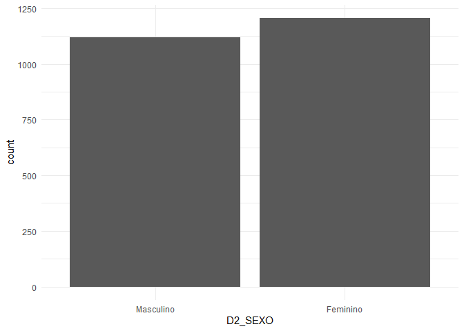
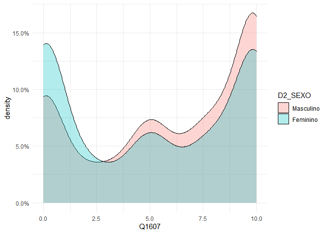
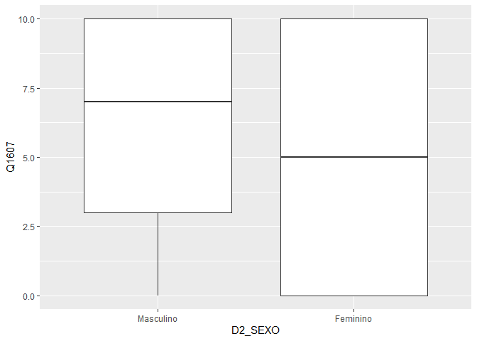
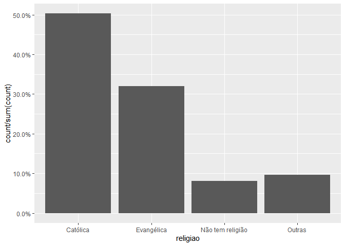
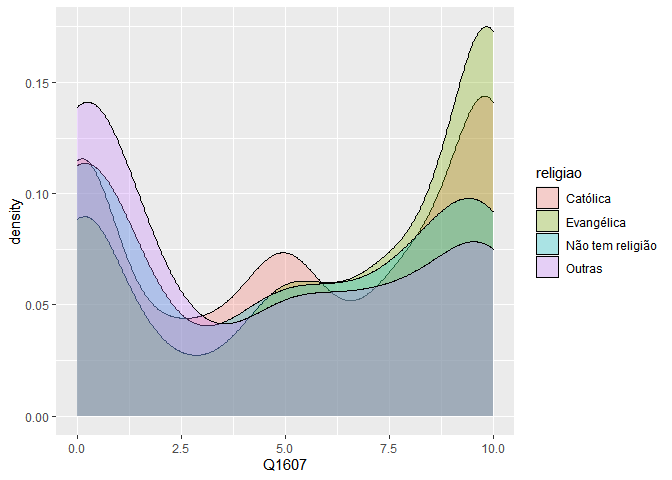
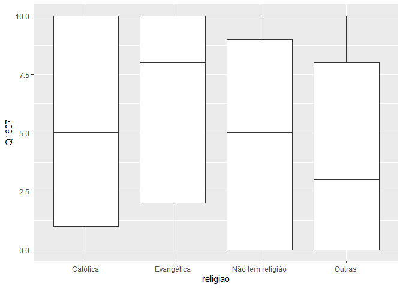
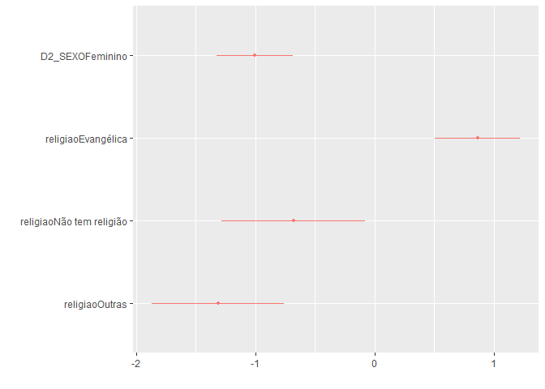

Exercício 8
================
Laís Oliveira

``` r
library(tidyverse)
```

    ## -- Attaching packages ------------------------------------------- tidyverse 1.3.0 --

    ## v ggplot2 3.3.1     v purrr   0.3.4
    ## v tibble  3.0.1     v dplyr   1.0.0
    ## v tidyr   1.1.0     v stringr 1.4.0
    ## v readr   1.3.1     v forcats 0.5.0

    ## -- Conflicts ---------------------------------------------- tidyverse_conflicts() --
    ## x dplyr::filter() masks stats::filter()
    ## x dplyr::lag()    masks stats::lag()

``` r
library(haven)
library(scales)
```

    ## Warning: package 'scales' was built under R version 4.0.2

    ## 
    ## Attaching package: 'scales'

    ## The following object is masked from 'package:purrr':
    ## 
    ##     discard

    ## The following object is masked from 'package:readr':
    ## 
    ##     col_factor

``` r
library(ggthemes)
```

    ## Warning: package 'ggthemes' was built under R version 4.0.2

``` r
link <- "https://github.com/MartinsRodrigo/Analise-de-dados/blob/master/04622.sav?raw=true"

download.file(link, "04622.sav", mode = "wb")

banco <- read_spss("04622.sav") 

banco <- banco %>%
  mutate(D2_SEXO = as_factor(D2_SEXO),
         D10 = as_factor(D10)) %>%
  filter(Q1607 < 11)
```

Representação gráfica da variável categórica D2\_SEXO

``` r
ggplot(banco, aes(D2_SEXO)) +
  geom_bar() +
  theme_minimal()
```

<!-- -->

Representação gráfica da associação entre sexo e nota atribuída a
Bolsonaro

``` r
ggplot(banco, aes(Q1607, fill = D2_SEXO)) +
  geom_density(alpha = 0.3) +
  scale_y_continuous(labels = percent) +
  theme_minimal()
```

    ## Don't know how to automatically pick scale for object of type haven_labelled/vctrs_vctr/double. Defaulting to continuous.

<!-- -->

``` r
ggplot(banco, aes(D2_SEXO, Q1607)) +
  geom_boxplot()
```

    ## Don't know how to automatically pick scale for object of type haven_labelled/vctrs_vctr/double. Defaulting to continuous.

<!-- -->

Teste de associação entre sexo e nota atribuida a Bolsonaro

``` r
banco %>%
  group_by(D2_SEXO) %>%
  summarise(mediana = median(Q1607),
            media = mean(Q1607),
            desvio = sd(Q1607),
            n = n())
```

    ## `summarise()` ungrouping output (override with `.groups` argument)

    ## # A tibble: 2 x 5
    ##   D2_SEXO   mediana media desvio     n
    ##   <fct>       <dbl> <dbl>  <dbl> <int>
    ## 1 Masculino       7  6.02   3.78  1120
    ## 2 Feminino        5  5.06   4.08  1206

``` r
t.test(Q1607 ~ D2_SEXO, data = banco)
```

    ## 
    ##  Welch Two Sample t-test
    ## 
    ## data:  Q1607 by D2_SEXO
    ## t = 5.88, df = 2324, p-value = 4.693e-09
    ## alternative hypothesis: true difference in means is not equal to 0
    ## 95 percent confidence interval:
    ##  0.6392909 1.2790608
    ## sample estimates:
    ## mean in group Masculino  mean in group Feminino 
    ##                6.020536                5.061360

Comparando as médias para cada categoria da variável D2\_SEXO
verificamos que as médias se diferem (6.02 para masculino e 5.06 para
feminino) indicando que pode existir uma associação. Confirmando a
hipótese de associação temos o intervalo de confiança (0.639 1.279) que
não contém o valor 0. Por fim, temos alto nível de confiança nos
resultados dado o p-valor de 4.693e-09.

Regressão linear bivariada entre sexo e nota atribuída a Bolsonaro

``` r
regressao <- lm(Q1607 ~ D2_SEXO, data = banco)

summary(regressao)
```

    ## 
    ## Call:
    ## lm(formula = Q1607 ~ D2_SEXO, data = banco)
    ## 
    ## Residuals:
    ##     Min      1Q  Median      3Q     Max 
    ## -6.0205 -4.0614 -0.0205  3.9795  4.9386 
    ## 
    ## Coefficients:
    ##                 Estimate Std. Error t value Pr(>|t|)    
    ## (Intercept)       6.0205     0.1178  51.112  < 2e-16 ***
    ## D2_SEXOFeminino  -0.9592     0.1636  -5.863 5.18e-09 ***
    ## ---
    ## Signif. codes:  0 '***' 0.001 '**' 0.01 '*' 0.05 '.' 0.1 ' ' 1
    ## 
    ## Residual standard error: 3.942 on 2324 degrees of freedom
    ## Multiple R-squared:  0.01458,    Adjusted R-squared:  0.01415 
    ## F-statistic: 34.38 on 1 and 2324 DF,  p-value: 5.178e-09

A partir da avaliação da regressão bivariada identificamos que a média
da variável dependente é de 6.02 representada pelo valor estimado do
intercepto, onde a linha de regressão se inicia, com erro padrão de
0.117 para mais e para menos. Tal informação tem alto nível de confiança
que se retira do p-valor de \< 2e-16. Com relação a mudança em Y dado um
aumento unitário em X, verificamos que as mulheres tendem a avaliar
Bolsonaro negativamente numa proporção de -0.959 em relação aos homens.
Ou seja, homens tendem a avaliar em 0.959 pontos melhor o candidato
quando comparados às respondentes mulheres. É o que se retira do
coeficiente beta estimado para a categoria feminina da variável
categórica, o que indica a categoria masculina como a categoria de
referência do modelo. Esta estimativa tem erro padrão de 0.163 para mais
e para menos e alto nível de confiança, pois o p-valor é de 5.18e-09. O
erro padrão residual do modelo é de 3.942 sendo a média das distâncias
verticais dos valores observados para os valores estimados.O r² de
0.014, indica que o modelo apresentado tem baixo desempenho, pois
explica somente 1.4% da variável dependente (avaliação de Bolsonaro).
Por fim, o modelo tem nível geral de confiança alto, devido ao p-valor
de 5.178e-09.

Representação da variável Religião

``` r
Outras <- levels(banco$D10)[-c(3,5,13)]

banco <- banco %>%
  mutate(religiao = case_when(D10 %in% Outras ~ "Outras",
                              D10 == "Católica" ~ "Católica",
                              D10 == "Evangélica" ~ "Evangélica",
                              D10 == "Não tem religião" ~ "Não tem religião"))


ggplot(banco, aes(religiao, ..count../sum(..count..) )) +
  geom_bar() +
  scale_y_continuous(labels = percent)
```

<!-- -->

Representação gráfica da associação entre religião e a nota atribuída a
Bolsonaro

``` r
ggplot(banco, aes(Q1607, fill = religiao)) +
  geom_density(alpha = 0.3)
```

    ## Don't know how to automatically pick scale for object of type haven_labelled/vctrs_vctr/double. Defaulting to continuous.

<!-- -->

``` r
ggplot(banco, aes(religiao, Q1607)) +
  geom_boxplot()
```

    ## Don't know how to automatically pick scale for object of type haven_labelled/vctrs_vctr/double. Defaulting to continuous.

<!-- -->

Teste estatístico da associação entre religião e nota atribuída a
Bolsonaro

``` r
kruskal.test(Q1607 ~ religiao, data = banco)
```

    ## 
    ##  Kruskal-Wallis rank sum test
    ## 
    ## data:  Q1607 by religiao
    ## Kruskal-Wallis chi-squared = 61.013, df = 3, p-value = 3.571e-13

``` r
pairwise.wilcox.test(banco$Q1607, banco$religiao,
                     p.adjust.method = "BH")
```

    ## 
    ##  Pairwise comparisons using Wilcoxon rank sum test with continuity correction 
    ## 
    ## data:  banco$Q1607 and banco$religiao 
    ## 
    ##                  Católica Evangélica Não tem religião
    ## Evangélica       7.4e-06  -          -               
    ## Não tem religião 0.043    8.3e-06    -               
    ## Outras           1.2e-05  4.4e-11    0.126           
    ## 
    ## P value adjustment method: BH

O teste de Kruskal por ter alto valor (61.013) indica que as diferenças
entre as médias do rank são também altas, com alto nível de confiança
(p-valor de 3.571e-13). Enquanto o teste de Wilcox indica que a maior
diferença entre média está entre as categorias “Outras” e “Não tem
religião”.

Regressão linear bivariada entre religião e nota atribuída a Bolsonaro

``` r
regressao1 <- lm(Q1607 ~ religiao, data = banco)

summary(regressao1)
```

    ## 
    ## Call:
    ## lm(formula = Q1607 ~ religiao, data = banco)
    ## 
    ## Residuals:
    ##    Min     1Q Median     3Q    Max 
    ## -6.259 -4.107  0.559  3.741  5.893 
    ## 
    ## Coefficients:
    ##                          Estimate Std. Error t value Pr(>|t|)    
    ## (Intercept)                5.4410     0.1146  47.470  < 2e-16 ***
    ## religiaoEvangélica         0.8184     0.1838   4.452 8.93e-06 ***
    ## religiaoNão tem religião  -0.6325     0.3081  -2.053   0.0402 *  
    ## religiaoOutras            -1.3339     0.2859  -4.665 3.26e-06 ***
    ## ---
    ## Signif. codes:  0 '***' 0.001 '**' 0.01 '*' 0.05 '.' 0.1 ' ' 1
    ## 
    ## Residual standard error: 3.921 on 2322 degrees of freedom
    ## Multiple R-squared:  0.0261, Adjusted R-squared:  0.02484 
    ## F-statistic: 20.74 on 3 and 2322 DF,  p-value: 2.936e-13

A regressão entre religião e avaliação de Bolsonaro mostra que a média
da variável dependente (avaliação) - indicada pelo valor estimado do
intercepto (alfa) - está em 5.441 pontos, onde se inicia a reta da
regressão, com erro padrão de 0.114 para mais e para menos e alto nível
de confiança dado o p-valor de \<2e-16. Analisando os betas, verificamos
que a catgoria de referência escolhida automaticamente pelo modelo é de
religião Católica. Portanto, o beta das outras categorias indica o valor
estimado em relação à categoria de referêcia. Assim, os respondentes
evangélicos tendem a avaliar Bolsonaro 0.818 pontos melhor
(positivamente) que os Católicos, com erro padrão de 0.183 para mais e
para menos e alto nível de confiança (p-valor = 8.93e-06). Aqueles que
não tem religião por sua vez, avaliam Bolsonaro pior (negativamente)
que os católicos em -0.632, com erro padrão de 0.308 e nível de
confiança padrão dado o p-valor de 0.040. Já os respondentes
identificados em outras religiões avaliam Bolsonaro negativamente em
-1.333 pontos em relação aos católicos, com erro padrão de 0.285 para
mais e para menos e alto nível de confiança pelo p-valor de 3.26e-06. O
erro padrão residual do modelo é de 3.921 que representa a distância
vertical dos valores observados para os valores estimados. O r² de 0.026
indica baixa eficiência do modelo, visto que é capaz de explicar somente
2.6% da avaliação de Bolsonaro. Por fim, o nível de confiança geral do
modelo é alto pois se retira do p-valor de 2.936e-13.

Regressão linear multivariada entre sexo, religião e nota atribuída a
Bolsonaro

``` r
regressao2 <- lm(Q1607 ~ D2_SEXO + religiao, data = banco)

summary(regressao2)
```

    ## 
    ## Call:
    ## lm(formula = Q1607 ~ D2_SEXO + religiao, data = banco)
    ## 
    ## Residuals:
    ##     Min      1Q  Median      3Q     Max 
    ## -6.8130 -3.9448  0.1915  3.7365  6.3682 
    ## 
    ## Coefficients:
    ##                          Estimate Std. Error t value Pr(>|t|)    
    ## (Intercept)                5.9493     0.1401  42.477  < 2e-16 ***
    ## D2_SEXOFeminino           -1.0045     0.1616  -6.215 6.07e-10 ***
    ## religiaoEvangélica         0.8637     0.1825   4.732 2.36e-06 ***
    ## religiaoNão tem religião  -0.6813     0.3057  -2.229   0.0259 *  
    ## religiaoOutras            -1.3130     0.2837  -4.629 3.88e-06 ***
    ## ---
    ## Signif. codes:  0 '***' 0.001 '**' 0.01 '*' 0.05 '.' 0.1 ' ' 1
    ## 
    ## Residual standard error: 3.889 on 2321 degrees of freedom
    ## Multiple R-squared:  0.04204,    Adjusted R-squared:  0.04039 
    ## F-statistic: 25.46 on 4 and 2321 DF,  p-value: < 2.2e-16

``` r
library(dotwhisker)
```

    ## Warning: package 'dotwhisker' was built under R version 4.0.2

``` r
dwplot(regressao2, conf.level = .95)
```

<!-- -->

O modelo de regressão multivariada apresentado aponta para a média de
5.949 da variável dependente, como indica o instercepto (alfa), onde a
reta da regressão se inicia no eixo Y, com erro padrão de 0.140 para
mais e para menos e alto nível de confiança (\<2e-16). O coeficiente
beta da variável independente para sexo mostra que as mulheres avaliam
negativamente Bolsonaro em -1 ponto (com erro padrão de 0.161 para mais
e para menos) em comparação aos homens, mantendo todas as outras
variáveis constantes. Para as variáveis de religião a categoria de
referência do modelo é a católica. Assim, os respondentes evangélicos
avaliam Bolsonaro em 0.863 pontos melhor (positivamente) que os
católicos, com erro padrão de 0.182 para mais e para menos e alto nível
de confiança (p-valor de 2.36e-06). Aqueles que não tem religião tendem
a avaliar Bolsonaro -0.681 pontos pior (negativamente) que os católicos,
com erro padrão de 0.305 e nível de confiança aceitável, dado o p-valor
de 0.025. Os respondentes de outras religiões avaliam Bolsonaro também
pior que os católicos em -1.313 pontos, com erro padrão de 0.283 para
mais e para menos e alto nível de confiança, visto o p-valor de
3.88e-06. O modelo apresenta erro padrão residual de 3.889 que
representa q distância vertical dos valores observados aos valores
estimados. O r² de 0.042 mostra baixa eficiência do modelo, uma vez que
só é capaz de explicar 4.2% da avaliaçao de Bolsonaro (variável
dependente). Por fim, o nível de confiança gerla do modelo é alto que se
retira do p-valor de \<2.2e-16. Pela demonstração gráfica da regressão
vemos os intervalos de confiança para cada valor estimado das variáveis
indepentes. Para a variável categórica religião temos o valores
estimados das categorias “Evangélica”, “Não tem religião” e “Outras”
quando comparados à categoria de referência “Católica”. Podemos ter alto
nível de confiança que a a categoria Evangélica terá valores diferentes
das outras categorias visto que as extremidades da linha do intervalo
não encontram, no eixo vertical, as linhas de intervalo das outras
categorias. Porém, o mesmo não pode ser dito das categorias “Não tem
religião” e “Outra”, pois dado o overlap de uma em relação à outra não
se pode afirmar com alta certeza que são diferentes uma da outra. Por
fim, ao verificarmos os intervalos das variáveis vemos que nehum contém
o valor 0, o que indica que podemos ter confiança na associação das
variáveis. Os intervalos apresentados contam com 95% de nível de
confiança.
