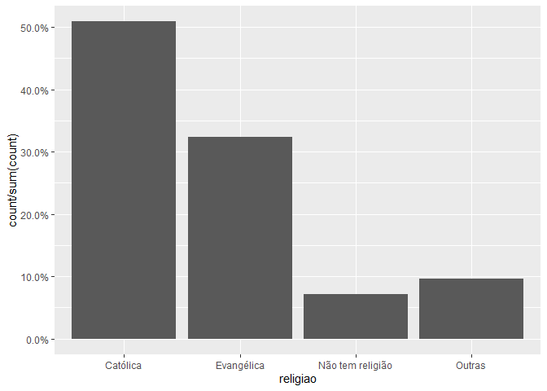
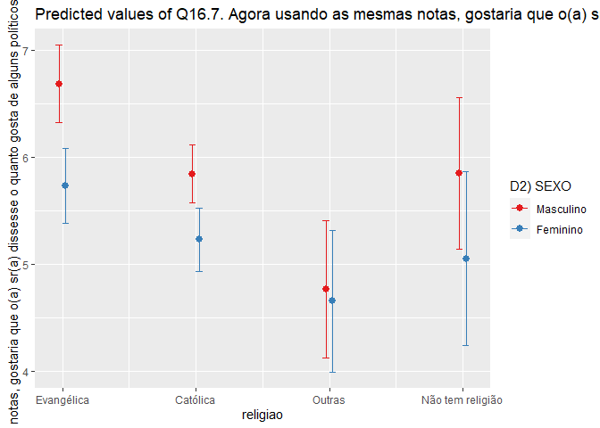

Exercicio 9
================

### Continuaremos com a utilização dos dados do ESEB2018. Carregue o banco da mesma forma que nos exercicios anteriores

``` r
library(tidyverse)
library(haven)
library(scales)

link <- "https://github.com/MartinsRodrigo/Analise-de-dados/blob/master/04622.sav?raw=true"

download.file(link, "04622.sav", mode = "wb")

banco <- read_spss("04622.sav") 

banco <- banco %>%
  mutate(D10 = as_factor(D10)) %>%
  filter(Q1607 < 11, 
         Q18 < 11,
         D9 < 9999998,
         Q1501 < 11)
```

### Crie a mesma variável de religião utilizada no exercício anterior

``` r
Outras <- levels(banco$D10)[-c(3,5,13)]

banco <- banco %>%
  mutate(religiao = case_when(D10 %in% Outras ~ "Outras",
                              D10 == "Católica" ~ "Católica",
                              D10 == "Evangélica" ~ "Evangélica",
                              D10 == "Não tem religião" ~ "Não tem religião"))


ggplot(banco, aes(religiao, ..count../sum(..count..) )) +
  geom_bar() +
  scale_y_continuous(labels = percent)
```

<!-- -->

### Faça uma regressão linear avaliando em que medida as variáveis independentes utilizadas nos exercícios 7 e 8, idade(D1A\_ID), educação (D3\_ESCOLA), renda (D9), nota atribuída ao PT (Q1501), auto-atribuição ideológica (Q18), sexo (D2\_SEXO) e religião (variável criada no passo anterior) explicam a avaliação de Bolsonaro (Q1607), mas com uma interação entre as variáveis religião e sexo. Exiba o resultado da regressão e interprete os valores dos coeficientes \(\beta\)s estimados.

``` r
regressao <- lm(Q1607 ~ religiao + D1A_ID +D3_ESCOLA + D9 + Q1501 + Q18 + D2_SEXO + religiao*D2_SEXO , data = banco)

summary(regressao)
```

    ## 
    ## Call:
    ## lm(formula = Q1607 ~ religiao + D1A_ID + D3_ESCOLA + D9 + Q1501 + 
    ##     Q18 + D2_SEXO + religiao * D2_SEXO, data = banco)
    ## 
    ## Residuals:
    ##    Min     1Q Median     3Q    Max 
    ## -8.942 -2.561  0.361  2.303  9.052 
    ## 
    ## Coefficients:
    ##                                    Estimate Std. Error t value Pr(>|t|)    
    ## (Intercept)                       6.114e+00  5.915e-01  10.338   <2e-16 ***
    ## religiaoEvangélica                1.181e+00  6.146e-01   1.921   0.0549 .  
    ## religiaoNão tem religião          1.986e-01  1.059e+00   0.188   0.8512    
    ## religiaoOutras                   -1.583e+00  9.503e-01  -1.666   0.0960 .  
    ## D1A_ID                            1.065e-02  6.255e-03   1.703   0.0888 .  
    ## D3_ESCOLA                        -1.134e-01  4.491e-02  -2.524   0.0117 *  
    ## D9                               -3.632e-05  2.768e-05  -1.312   0.1897    
    ## Q1501                            -3.956e-01  2.370e-02 -16.696   <2e-16 ***
    ## Q18                               3.150e-01  2.607e-02  12.083   <2e-16 ***
    ## D2_SEXO                          -6.115e-01  2.438e-01  -2.508   0.0122 *  
    ## religiaoEvangélica:D2_SEXO       -3.412e-01  3.895e-01  -0.876   0.3812    
    ## religiaoNão tem religião:D2_SEXO -1.889e-01  6.979e-01  -0.271   0.7867    
    ## religiaoOutras:D2_SEXO            5.041e-01  6.067e-01   0.831   0.4062    
    ## ---
    ## Signif. codes:  0 '***' 0.001 '**' 0.01 '*' 0.05 '.' 0.1 ' ' 1
    ## 
    ## Residual standard error: 3.297 on 1449 degrees of freedom
    ## Multiple R-squared:  0.3028, Adjusted R-squared:  0.297 
    ## F-statistic: 52.44 on 12 and 1449 DF,  p-value: < 2.2e-16

O intercepto representa o ponto no eixo Y quando todas as variáveis
independentes são igual a zero, assim que pode-se esperar com alto nível
de confiança (\<2e-16 \*\*\*) que a reta de regressão se inicia em
6.114e+00 pontos. Para a variável de religião, verificamos que a
categoria de referência é a católica, portanto as outras categorias
serão interpretar segundo sua diferença em relação aos católicos.
Então, os evangélicos avaliam melhor Bolsonaro em 1.181e+00 pontos
quando commparados aos católicos. Aqueles que não tem religião também
avaliam melhor Bolsonaro, mas em 1.986e-01 pontos em relação aos
católicos. Enquanto os que se identificam com outras religiões avaliam
pior Bolsonaro em -1.583e+00 pontos quando comparados aos católicos. Em
relação à idade, nota-se uma mudança de 1.065e-02 na avaliação de
Bolsonaro para um aumento unitário na idade dos respondentes,
controlando por todas as outras variáveis independentes. Quanto à
educação, quando de um aumento unitário na escala de escolaridade,
verificamos um decréscimo na avaliação de Bolsonaro em -1.134e-01
pontos, mantendo todas as outras variáveis independentes constantes.
Para a renda, temos um decréscimo de -3.632e-05 pontos na avaliação para
um aumento unitário dessa variável, mantendo as outras estáveis. Em se
tratando da avaliação do PT, quanto melhor se avalia esse partido
(acréscimo de uma unidade) pior se avalia Bolsonaro (diminuição de
-3.956e-01 pontos), controlando por todas as outras variáveis. Ao
analisarmos a variável de auto-atribuição ideológica, considerando a
escala de 0 para esquerda do espectro político e 10 para direita do
mesmo espectro, verificamos que aqueles que se identificam mais à
direita (acréscimo unitário) avaliam melhor Bolsonaro (em 3.150e-01
pontos), mantendo constantes as demais variáveis independentes. Quanto
ao sexo, podemos identificar a categoria de referência como a masculina,
já que se encontra no primeiro nível desse fator, assim as mulheres
avaliam pior Bolsonaro em -6.115e-01 pontos, enquanto os homens avaliam
melhor em 6.115e-01 pontos, todas as outras variáveis independentes
constantes. Por fim, os coeficientes da interação mostram as mudanças na
variável dependente quando cada categoria de religião é zero e sexo é
zero (masculino). Portanto, quando temos homens evangélicos há uma
mudança de -3.412e-01, homens sem religião há uma mudança de -1.889e-01
e homens de outras religiões há uma mudança de 5.041e-01 na avaliação de
Bolsonaro.

### Interprete a significancia estatística dos coeficientes estimados

Para o intercepto (ponto em Y para todas as variáveis independentes
iguais a zero), e as variáveis de avaliação do PT (Q1501) e
auto-atribuição ideológica (Q18) temos alto nível de confiança visto
sua significância estatística pelo p-valor de \<2e-16. Para as variáveis
de educação (D3\_ESCOLA) de sexo (D2\_SEXO), temos significância
estatística aceitável para os padrões acadêmicos. Para as categorias
“Evangélica” e “Outras” da variável religião e a variável de idade
temos nível de confiança em cerca de 90%, o que ainda pode ser
condsiderado aceitável. No entanto a categoria “Não tem religião” e a
variável de renda (D9) não apresentaram significância estatística visto
seu alto p-valor. Para as variáveis na interação o p-valor não deve ser
considerado, pois ele pode variar caso os valores das variáveis mudem.
Para melhor visualizar a significância estatística verificamos o gráfico
da interação.

### Faça um gráfico que mostre a interação entre as duas variáveis. Interprete o resultado apresentado

``` r
library(sjPlot)

plot_model(regressao, type = "pred", 
           terms = c("religiao", "D2_SEXO"), 
           ci.lvl = 0.9)
```

<!-- -->

Na análise do gráfico vemos que há diferença para os sexos somente nas
categorias de religião “Católica” e “Evangélica”, visto que apresentam
significância estatísca por seus intervalos não se sobreporem. Para as
categorias “Outras” e “Não tem religião”, não podemos afirmar com
certeza que há diferença em relação aos sexos pois seu intervalos de
confiança se sobrepoem no gráfico. Podemos também concluir que, em
geral, homens avaliam melhor Bolsonaro que mulheres, indepedente da
religião.
